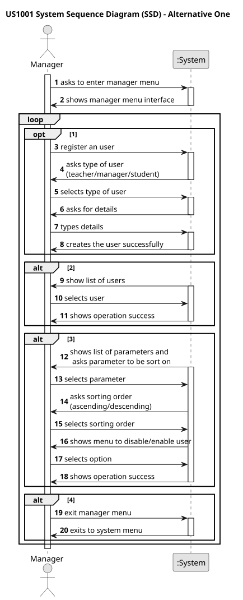
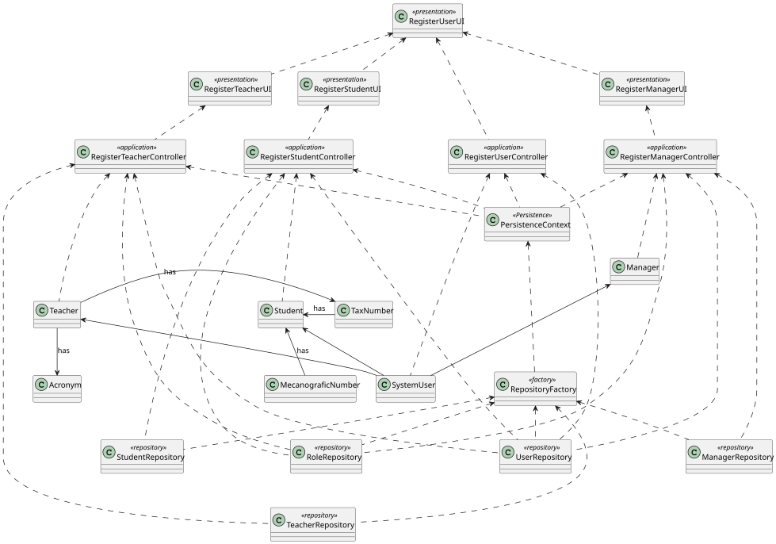

# US 1001

*To register, disable, and list users*

## 1. Context

*As Manager, I want to be able to register, disable/enable, and list users of the system (Teachers and Students, as well as Managers).*
## 2. Requirements


## 3. Analysis
*System Sequence Diagram*



## 4. Design

### 4.1. Realization

*Sequence Diagram*


### 4.2. Class Diagram



### 4.3. Applied Patterns

### 4.4. Tests

*1. Manager class tests*

**Test 1.1:** 

```
@Test
    public void ensureManagerEqualsAreTheSameForTheSameInstance() throws Exception {
        final Manager manager = new ManagerBuilder()
                .systemUser(getNewDummyUser()).build();

        final boolean expected = manager.equals(manager);

        assertTrue(expected);
    }
````

**Test 1.2:**

```
    @Test
    public void ensureManagerEqualsFailsForDifferentObjectTypes() throws Exception {
        final Set<Role> roles = new HashSet<>();
        roles.add(BaseRoles.ADMIN);

        final Manager aManager = new ManagerBuilder().systemUser(getNewDummyUser()).build();

        final boolean expected = aManager.equals(getNewDummyUser());

        assertFalse(expected);
    }
````

**Test 1.3:**

```
 @Test
    public void ensureManagerIsTheSameAsItsInstance() throws Exception {
        final Manager aManager = new ManagerBuilder()
                .systemUser(getNewDummyUser()).build();

        final boolean expected = aManager.sameAs(aManager);

        assertTrue(expected);
    }
````

*2. Student class tests*

**Test 2.1:**

```
    @Test
    public void ensureStudentEqualsPassesForTheSameMecanographicNumber() throws Exception{
        final Student aStudent = new StudentBuilder().mecanographicNumber(aMecanographicNumber).systemUser(getNewDummyUser()).build();

        final Student anotherStudent = new StudentBuilder().mecanographicNumber(aMecanographicNumber).systemUser(getNewDummyUser()).build();

        final boolean expected= aStudent.equals(anotherStudent);
        assertTrue(expected);

    }
````

**Test 2.2:**

```
    @Test
    public void ensureStudentEqualsFailsForDifferentMecanographicNumber()throws Exception {
        final Set<Role> roles=new HashSet<>();
        roles.add(BaseRoles.ADMIN);

        final Student aStudent = new StudentBuilder().mecanographicNumber(anotherMecanographicNumber).systemUser(getNewDummyUser()).build();

        final Student anotherStudent = new StudentBuilder().mecanographicNumber(aMecanographicNumber).systemUser(getNewDummyUser()).build();

        final boolean expected= aStudent.equals(anotherStudent);
        assertFalse(expected);
    }
````

**Test 2.3:**

```
    @Test
    public void ensureStudentEqualsAreTheSameForTheSameInstance() throws Exception {
        final Student student = new Student();

        final boolean expected = student.equals(student);

        assertTrue(expected);
    }
````

**Test 2.4:**

```
    @Test
    public void ensureClientUserEqualsFailsForDifferenteObjectTypes() throws Exception {
        final Set<Role> roles = new HashSet<>();
        roles.add(BaseRoles.ADMIN);

        final Student aStudent = new StudentBuilder().mecanographicNumber(aMecanographicNumber)
                .systemUser(getNewDummyUser()).build();

        final boolean expected = aStudent.equals(getNewDummyUser());

        assertFalse(expected);
    }
````

**Test 2.5:**

```
    @Test
    public void ensureStudentIsTheSameAsItsInstance() throws Exception {
        final Student aStudent = new StudentBuilder().mecanographicNumber(aMecanographicNumber)
                .systemUser(getNewDummyUser()).build();

        final boolean expected = aStudent.sameAs(aStudent);

        assertTrue(expected);
    }
````

**Test 2.6:**

```
    @Test
    public void ensureTwoStudentsWithDifferentMecanographicNumbersAreNotTheSame() throws Exception {
        final Set<Role> roles = new HashSet<>();
        roles.add(BaseRoles.ADMIN);
        final Student aStudent = new StudentBuilder().mecanographicNumber(aMecanographicNumber)
                .systemUser(getNewDummyUser()).build();

        final Student anotherStudent = new StudentBuilder()
                .mecanographicNumber(anotherMecanographicNumber).systemUser(getNewDummyUser()).build();

        final boolean expected = aStudent.sameAs(anotherStudent);

        assertFalse(expected);
    }
````

*3. Teacher class tests*

**Test 3.1:**

```
    @Test
    public void ensureTeacherEqualsPassesForTheSameAcronym() throws Exception{
        final Teacher aTeacher = new TeacherBuilder().acronym(anAcronym).systemUser(getNewDummyUser()).build();

        final Teacher anotherTeacher = new TeacherBuilder().acronym(anAcronym).systemUser(getNewDummyUser()).build();

        final boolean expected= aTeacher.equals(anotherTeacher);
        assertTrue(expected);

    }
````

**Test 3.2:**

```
    @Test
    public void ensureTeacherEqualsFailsForDifferentAcronyms()throws Exception {
        final Set<Role> roles=new HashSet<>();
        roles.add(BaseRoles.ADMIN);

        final Teacher aTeacher = new TeacherBuilder().acronym(anotherAcronym).systemUser(getNewDummyUser()).build();

        final Teacher anotherTeacher = new TeacherBuilder().acronym(anAcronym).systemUser(getNewDummyUser()).build();

        final boolean expected= aTeacher.equals(anotherTeacher);
        assertFalse(expected);
    }
````

**Test 3.3:**

```
    @Test
    public void ensureTeacherEqualsAreTheSameForTheSameInstance() throws Exception {
        final Teacher teacher = new TeacherBuilder().acronym(anAcronym)
                .systemUser(getNewDummyUser()).build();

        final boolean expected = teacher.equals(teacher);

        assertTrue(expected);
    }
````

**Test 3.4:**

```
    @Test
    public void ensureTeacherEqualsFailsForDifferentObjectTypes() throws Exception {
        final Set<Role> roles = new HashSet<>();
        roles.add(BaseRoles.ADMIN);

        final Teacher aTeacher = new TeacherBuilder().acronym(anAcronym)
                .systemUser(getNewDummyUser()).build();

        final boolean expected = aTeacher.equals(getNewDummyUser());

        assertFalse(expected);
    }
````

**Test 3.5:**

```
  @Test
    public void ensureTeacherIsTheSameAsItsInstance() throws Exception {
        final Teacher aTeacher = new TeacherBuilder().acronym(anAcronym)
                .systemUser(getNewDummyUser()).build();

        final boolean expected = aTeacher.sameAs(aTeacher);

        assertTrue(expected);
    }
````

**Test 3.6:**

```
    @Test
    public void ensureTwoTeachersWithDifferentAcronymsAreNotTheSame() throws Exception {
        final Set<Role> roles = new HashSet<>();
        roles.add(BaseRoles.ADMIN);
        final Teacher aTeacher = new TeacherBuilder().acronym(anAcronym)
                .systemUser(getNewDummyUser()).build();

        final Teacher anotherTeacher = new TeacherBuilder()
                .acronym(anotherAcronym).systemUser(getNewDummyUser()).build();

        final boolean expected = aTeacher.sameAs(anotherTeacher);

        assertFalse(expected);
    }
````

