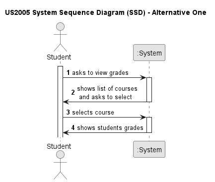
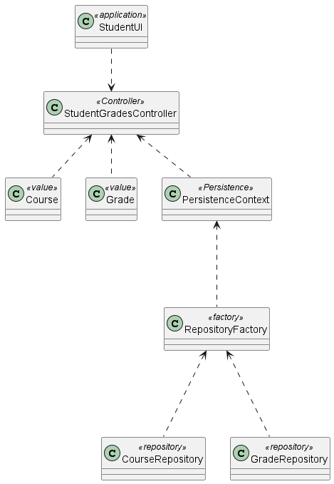
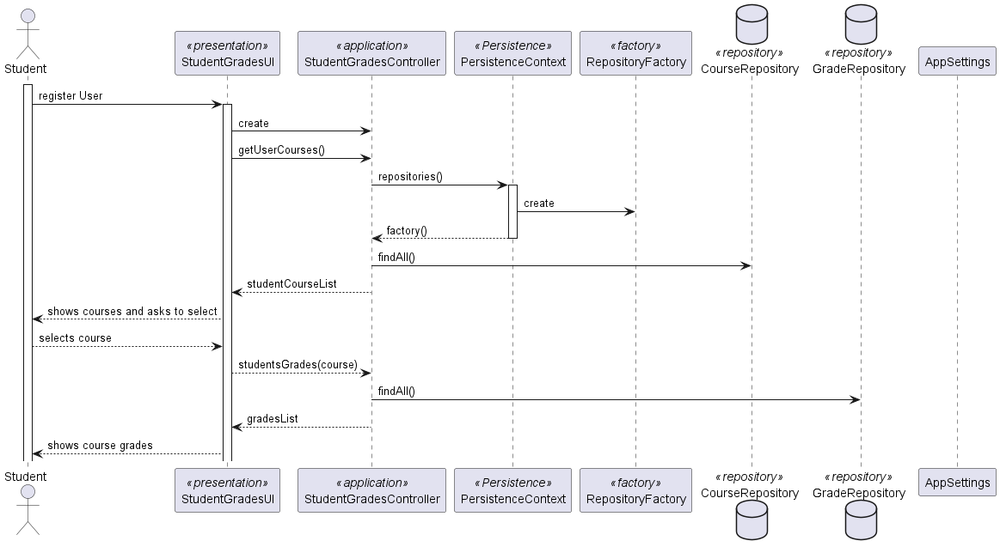

# US 2005

*To list a students grades*

## 1. Context

*As Student, I want to view a list of my grades*
## 2. Requirements


## 3. Analysis

*System Sequence Diagram*


## 4. Design

*In this sections, the team should present the solution design that was adopted to solve the requirement. This should include, at least, a diagram of the realization of the functionality (e.g., sequence diagram), a class diagram (presenting the classes that support the functionality), the identification and rational behind the applied design patterns and the specification of the main tests used to validade the functionality.*

### 4.1. Realization



### 4.2. Class Diagram



### 4.3. Applied Patterns

- Pure Fabrication
- Creator
- Controller

### 4.4. Tests

**Test 1:** 
```
    @Test
    public void testGradeInitialization() {
        Exam exam = new Exam(examTitle, examContent, course);
        int score = 85;

        Grade grade = new Grade(exam, score, student);

        assertEquals(exam, grade.getExam());
        assertEquals(score, grade.getScore());

    }
````

**Test 2:** 
```
       @Test
    public void testGradeSameAsReturnsTrueForTheSameInstance() {
        Exam exam = new Exam(examTitle, examContent, course);
        int score = 85;

        Grade grade = new Grade(exam, score, student);

        boolean expected = grade.sameAs(grade);

        assertFalse(expected);
    }
````

**Test 3:** 
```
    @Test
    public void testGradeSameAsReturnsFalseForDifferentInstances() {
        Exam exam1 = new Exam(examTitle, examContent, course);
        int score1 = 85;
        //Student student1 = new Student(null,null,null);

        Grade grade1 = new Grade(exam1, score1,null);

        Exam exam2 = new Exam(examTitle, examContent, course);
        int score2 = 90;
        //Student student2 = new Student();

        Grade grade2 = new Grade(exam2, score2, null);

        boolean expected = grade1.sameAs(grade2);

        assertFalse(expected);
    }
````

## 5. Implementation

### [Class](C:\Users\phenr\github-classroom\Departamento-de-Engenharia-Informatica\sem4pi-22-23-55\base.core\src\main\java\eapli\base\studentManagement\domain\Student.java)

### [Controller](C:\Users\phenr\github-classroom\Departamento-de-Engenharia-Informatica\sem4pi-22-23-55\base.core\src\main\java\eapli\base\examManagement\application\StudentGradesController.java)

### [UI](eapli/base/app/other/console/presentation/grades/StudentGradesUI.java)

### [Repository](C:\Users\phenr\github-classroom\Departamento-de-Engenharia-Informatica\sem4pi-22-23-55\base.core\src\main\java\eapli\base\examManagement\repositories\GradeRepository.java)
## 6. Integration/Demonstration
