# US 3006 - As a User, I want to create a post-it on a board

## 1. Context

This component of the system has particular technical requirements, with a focus on addressing synchronization issues.
Multiple clients may attempt to update boards simultaneously, so the solution must incorporate threads, condition
variables, and mutexes in its design and implementation. Detailed requirements will be provided in SCOMP.

## 2. Requirements

**US 3006** As a User, I want to create a post-it on a board

- 3006.1. This requirement involves the development of functionality that allows users to create and add post-it notes to a board within the system.

- 3006.2. The implementation must take into account synchronization issues, as multiple clients may attempt to update boards simultaneously.

Regarding this requirement, we understand that it relates to the past User Story, given on Sprint B, ["As User, I want to create a board"](../us_g3002) .

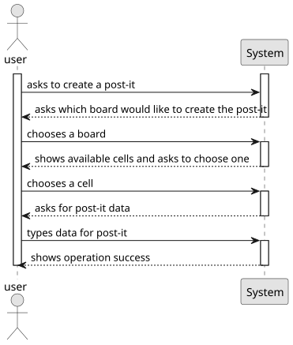

## 3. Analysis

In order to address the requirement of allowing users to create post-it notes on a board, our team conducted a thorough analysis of the technical requirements and potential design solutions. Our primary focus was on addressing synchronization issues that may arise when multiple clients attempt to update boards simultaneously.

To ensure that updates to the board are properly synchronized, we decided to incorporate threads, condition variables, and mutexes into our design and implementation. This approach will allow us to effectively manage concurrent updates and prevent conflicts or inconsistencies.

In addition to our technical analysis, we also considered the business rules associated with this requirement. Specifically, we took into account the fact that only users with write permission may post content to a cell in the board, and that the content can be either text or an image. We also considered the need for the server to notify all clients with access to the board when an update is committed.

Based on our analysis, we believe that our proposed solution will effectively address the requirement of allowing users to create post-it notes on a board while also ensuring proper synchronization of updates.

## 4. Design

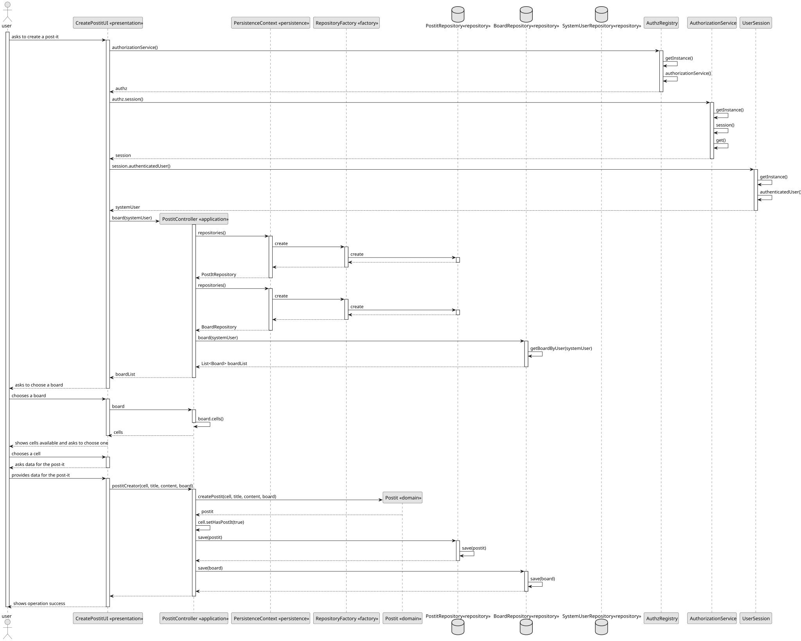

### 4.1. Realization

To realize the functionality of creating a post-it on a board and address the synchronization issues, the system can follow a client-server architecture with the following components and mechanisms:

**Client-Server Communication:** Clients interact with the server to create and update post-it notes on the board. The server manages the synchronization of concurrent updates and ensures data consistency.

**Real-Time Notification:** Implement an event-driven notification system or a publish-subscribe pattern to notify clients of updates.
Whenever a post-it is created or updated, send a notification to all clients connected to the board.
This can be achieved by leveraging technologies such as WebSockets, server-sent events (SSE), or a dedicated notification service.

**Synchronization Mechanisms:** Use threads, condition variables, and mutexes to handle synchronization issues.
When a client wants to create or update a post-it note, the server should acquire a lock (mutex) for that specific board to ensure exclusive access during the update process.
This prevents conflicts when multiple clients try to modify the same board concurrently.
Once the update is complete, the server releases the lock, allowing other clients to access the board.

**Error Handling:** Implement appropriate error handling mechanisms to handle exceptions, network errors, and other potential issues.
Ensure that the system provides informative error messages to clients in case of failures.
Consider common error scenarios such as network connectivity problems, unauthorized access attempts, or invalid post-it note content.

By incorporating real-time notification and error handling into the solution, the system becomes more robust and user-friendly. Real-time notifications keep clients updated with the latest changes on the board, improving collaboration and user experience. Effective error handling ensures that clients receive meaningful feedback and can take appropriate actions when errors occur.

These additions enhance the overall functionality of the system, making it more reliable, responsive, and user-centered.

### 4.2. Class Diagram

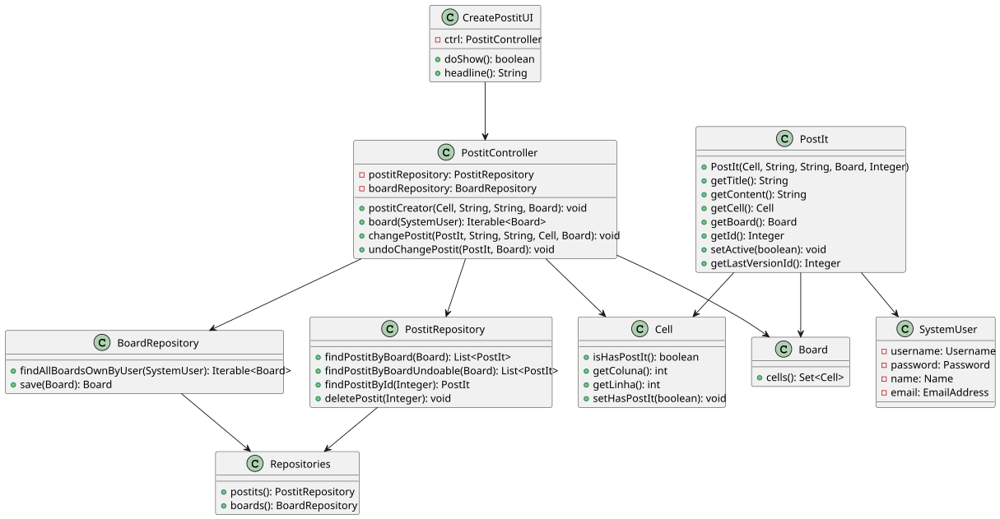

### 4.3. Applied Patterns

**Client-Server Architecture:** This pattern is suitable for managing the communication between clients and the server. The clients interact with the server to create and update post-it notes on the board, while the server manages the synchronization of concurrent updates and ensures data consistency.

**Publish-Subscribe Pattern:** This pattern can be used to implement the real-time notification system. When a post-it is created or updated, the server can publish an event or message indicating the change. The clients that are subscribed to the board will receive the notification and can update their respective views accordingly.

**Thread-Safe Singleton Pattern:** This pattern can be applied to the server implementation to ensure that only one instance of the server exists and that it can handle multiple client requests concurrently. The singleton instance can encapsulate the synchronization mechanisms such as mutexes and condition variables to manage concurrent access to the board.

**Locking Pattern:** The server can utilize locking mechanisms, such as mutexes or semaphores, to ensure exclusive access to the board during updates. When a client wants to create or update a post-it note, the server acquires the lock for that specific board, preventing other clients from modifying it simultaneously. Once the update is complete, the lock is released, allowing other clients to access the board.

### 4.4. Tests

**Test 1:** *Verifies that an image contains "http"*

```
@Test
    public void testContentContainsHttpWhenTypeIsImage() {
            int typeOfContent = 2;
            if (typeOfContent == 1) {
                // Test case not applicable for typeOfContent 1
            } else if (typeOfContent == 2) {
                String content = "https://www.bing.com/images/search?view=detailV2&ccid=ilvIUpk5&id=53C71CFF9E743B79670914004530CA525B25DC27&thid=OIP.ilvIUpk5eCS26XBmYT9lUwHaE9&mediaurl=https%3a%2f%2fget.pxhere.com%2fphoto%2fhair-white-view-animal-cute-pet-fur-cat-mammal-facial-expression-close-up-nose-whiskers-sleepy-eye-furry-head-skin-moustache-vertebrate-expression-soft-ragdoll-animal-world-domestic-cat-himalayan-persian-breed-cat-cat-face-macro-photography-cat%27s-eyes-cat-portrait-mimic-german-longhaired-pointer-schmusekatze-small-to-medium-sized-cats-cat-like-mammal-domestic-long-haired-cat-british-semi-longhair-birman-893129.jpg&cdnurl=https%3a%2f%2fth.bing.com%2fth%2fid%2fR.8a5bc85299397824b6e97066613f6553%3frik%3dJ9wlW1LKMEUAFA%26pid%3dImgRaw%26r%3d0&exph=2592&expw=3872&q=cat&simid=607991108465417427&FORM=IRPRST&ck=104BA8EE5251F960E592BBDFE24B6612&selectedIndex=2&ajaxhist=0&ajaxserp=0";
                assertTrue("Content should contain 'http'", content.contains("http"));
            } else {
                // Unexpected typeOfContent value, fail the test
                assertFalse("Unexpected typeOfContent value", true);
            }
        }
````

**Test 2:** *Verifies that even though was selected type image, string doesn't contain "http"*

```
@Test   
    public void testContentDoesNotContainHttpWhenTypeIsImage() {
        int typeOfContent = 2;
        if (typeOfContent == 1) {
            // Test case not applicable for typeOfContent 1
        } else if (typeOfContent == 2) {
            String content = "this is not an image";
            assertFalse("Content should not contain 'http'", content.contains("http"));
        } else {
            // Unexpected typeOfContent value, fail the test
            assertFalse("Unexpected typeOfContent value", true);
        }
    }
````

## 5. Implementation

### CreatePostitUI

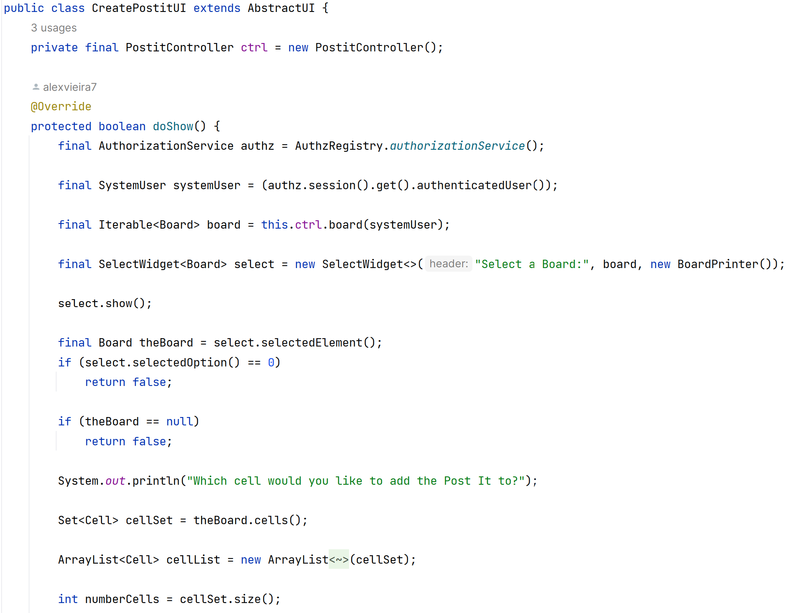

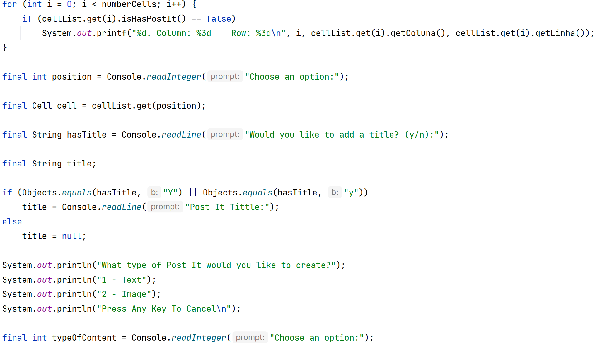

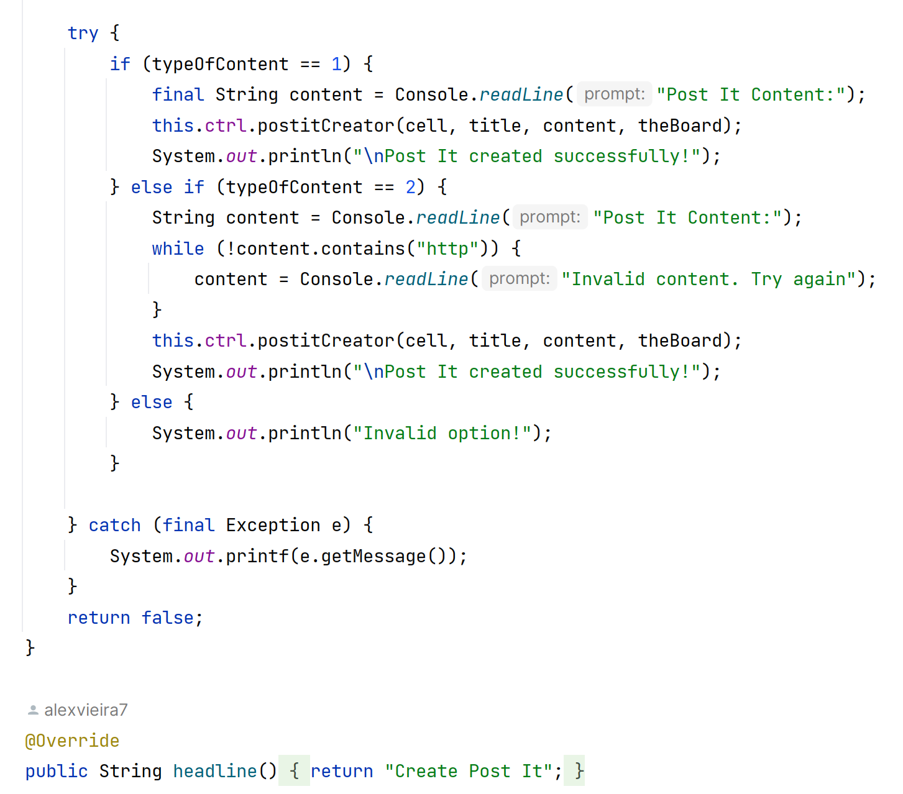

### PostitController

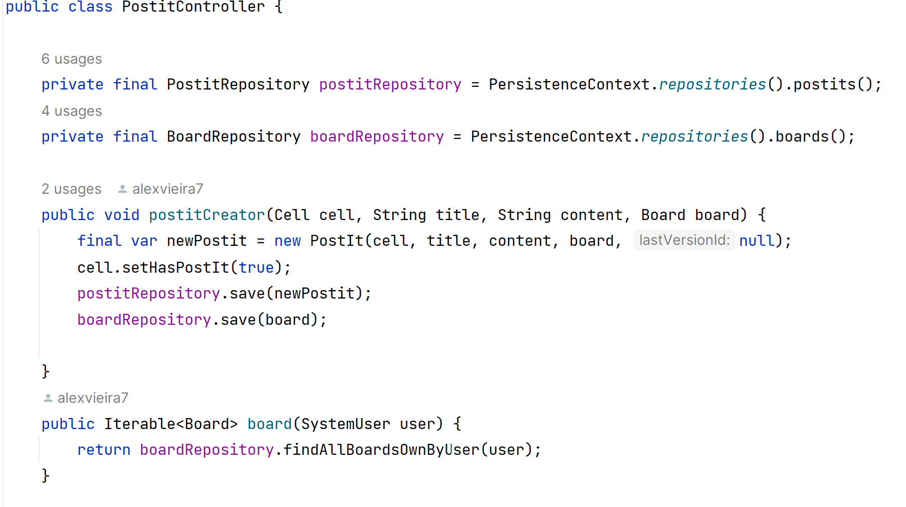

### PostitRepositories

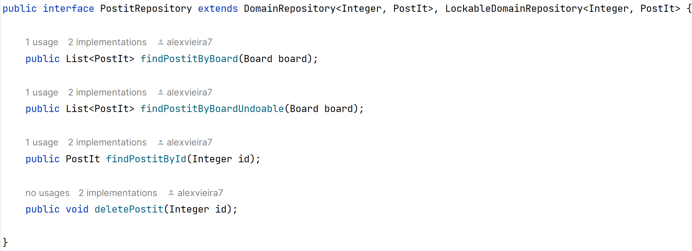

### Postit

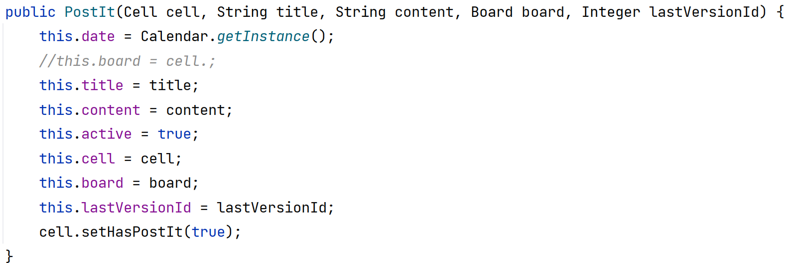

## 6. Integration/Demonstration

This is the User Interface of the application:

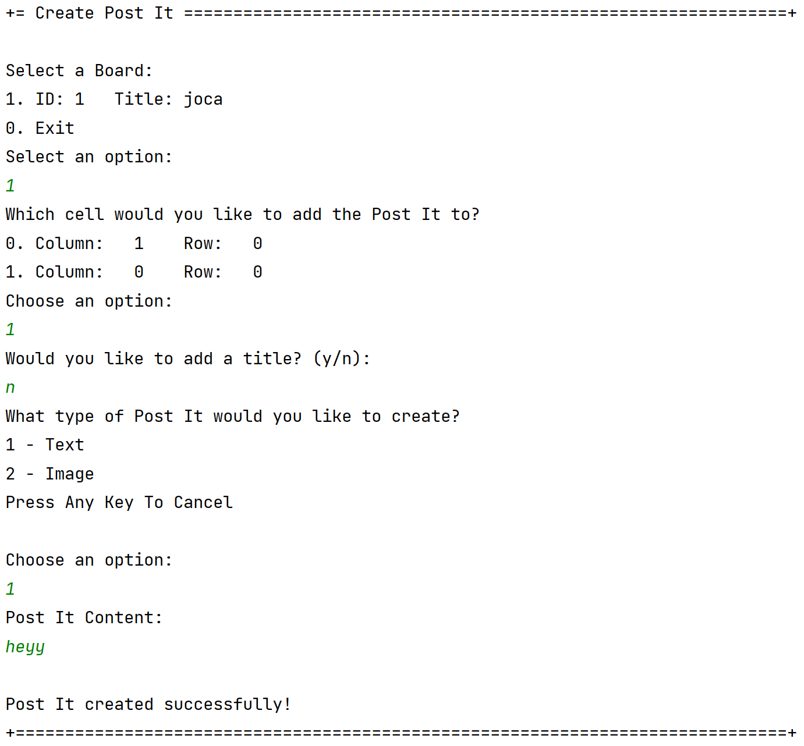

And this is the result of the application in the database:

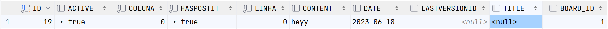

## 7. Observations

No specific observations.