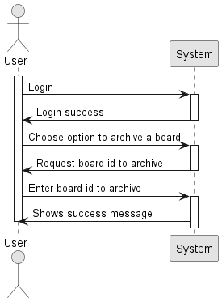
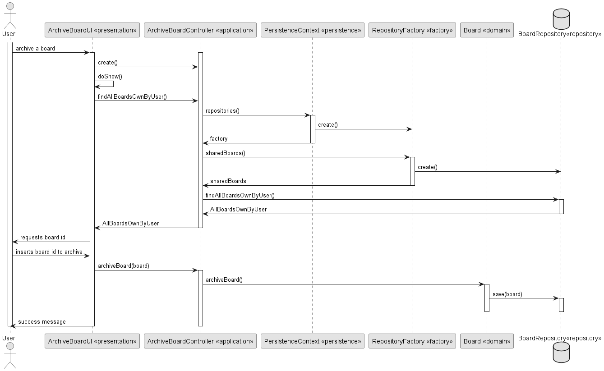
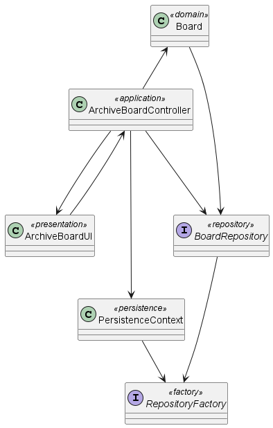

# US 3010 - As User, I want to archive a board I own

## 1. Context

*In this task, the user wants to archive a board he previously created*

## 2. Requirements

*Presentation of the functionality being developed*

**US G3010** As User, I want to archive a board I own.

- G3010.1. Solution design

- G3010.2. Solution implementation

## 3. Analysis

In this section, we report the study/analysis/comparison that was done to make the best design decisions for the requirement.

- The user is responsible for archiving a board.
- The board has a title, rows, columns, users, a cell and a creator.
- The board can only be archived by it´s own creator.

## 4. Design

*This section presents the design of the solution that was adopted to solve the requirement.*

Domain class: Board

Values Objects: active, archivedOn, creator

Controller: ArchiveBoardController

Repository: BoardRepository

### 4.1. Realization

### 4.2. Class Diagram

### 4.3. Applied Patterns

- Pure Fabrication
- Creator
- Controller

### 4.4. Tests

## 5. Implementation

### [Class](eapli/base/boardManagement/domain/Board.java)

### [Controller](eapli/base/boardManagement/application/ArchiveBoardController.java)

### [Repository](eapli/base/boardManagement/repositories/BoardRepository.java)

## 7. Observations

No specific observations provided.