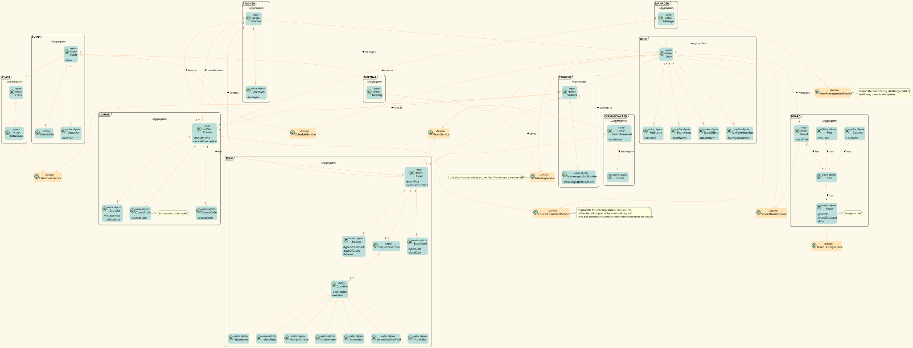

# US G002

## 1. Context

Domain-Driven Design (DDD) is a software development approach that emphasizes the importance of understanding and modeling the problem domain in order to create high-quality, flexible, and maintainable software systems. It involves identifying and organizing the core concepts, entities, and behaviors of a business domain, and using them to guide the design and implementation of software solutions. 

DDD also emphasizes the use of ubiquitous language, which ensures that the software development team and business stakeholders are using the same terminology to discuss the problem domain. This helps to reduce miscommunications and misunderstandings, and ultimately leads to better software that more accurately reflects the needs of the business.

## 2. Requirements

US G002 - As Project Manager, I want the team to elaborate a Domain Model using DDD

- G002.1. Analyze project description and identify key concepts.

- G002.2. Create a domain model based on the identified concepts.

Regarding this requirement, the only task required was to analyze the project description and create a domain model. No dependencies or correlations with other requirements were identified.

## 3. Analysis

In a Domain-Driven Design (DDD) model, an aggregate is a cluster of related objects that are treated as a single unit for the purpose of data consistency and transactional boundaries. The aggregate represents a transactional boundary, meaning that any changes made to the objects within the aggregate must be treated as a whole and either succeed or fail as a unit.

An entity is an object that has a unique identity and is distinguishable from other objects based on its attributes. Entities are usually part of an aggregate, but they can also exist independently.

A root is the primary entity within an aggregate that acts as a gateway to access other entities within the same aggregate. It's responsible for enforcing the aggregate's business rules and ensuring the consistency of the data within the aggregate. The root is the only object in the aggregate that can be accessed from outside the aggregate, and it's the only object that can be referenced from another aggregate.

A service is an operation or behavior that doesn't naturally belong to an entity or aggregate. It's a way of encapsulating complex business logic that doesn't fit into the domain objects themselves. Services can be used to coordinate actions across multiple aggregates or entities, or to perform calculations or validations that require information from multiple sources.

An event is a notification that something has happened within the system. Events can be used to communicate changes within an aggregate, between aggregates, or between different systems. They're typically used to ensure eventual consistency across different parts of the system, or to trigger actions in response to changes in the domain.

## 4. Design

### 4.1. Realization

After analyzing the project description and gathering knowledge from EAPLI classes, the team applied the appropriate design patterns to the realization of the functionality. The adopted design patterns were chosen based on their suitability to solve the specific requirements of the project. The resulting class diagram reflect the implementation of these design patterns.

### 4.2. DDD

### 4.3. Applied Patterns

As stated above, all the patterns applied were learned in EAPLI classes.

The system is composed of different aggregates and services that interact with each other to provide the required functionality. The main aggregates in the system are:

- **User Aggregate:** This aggregate was created with the goal of reducing redundancy in the code by having all users share similar attributes such as name, email, and password. The Student and Manager Aggregates were created as subtypes of the User Aggregate, with additional attributes specific to each role.

- **Course Aggregate:** A Course is a set of information related to a specific course, such as course name, duration, syllabus, responsible teachers, class schedules, and location.

- **Event Aggregate:** An Event serves to contain common information from meetings and classes, including the date and other relevant information.

- **Meeting Aggregate:** A Meeting is a set of information related to a specific meeting, such as the date, time, place, participants, and agenda to be discussed.

- **Class Aggregate:** A Class is a set of information related to a specific class, such as the name of the teacher, the students enrolled, and the times of classes.

- **Board Aggregate:** The Boards are a useful teaching tool that allows users to organize ideas and information. The system includes a SharedBoardService that enables users to see and edit boards in real-time.

- **Exam Aggregate:** An Exam is a set of information related to a specific automaticExam, such as the subject, date, time, location, number of students enrolled, and evaluation criteria.

To provide the required functionality, the system also includes different services such as:

- **CourseEnrollmentService:** This service is responsible for updating the state of a student in a course.

- **SharedBoardService:** This service allows all users to see and edit boards in real-time.

- **ScheduleService:** This service is responsible for getting the schedule of each user and checking availability to avoid conflicts.

- **MeetingService:** This service is responsible for the creation, management, and execution of meetings. It enables features such as screen sharing, chat, and attendance control.

- **ExtraClassService:** This service is responsible for showing the availability of the students to the teacher and scheduling extra classes.

- **UserManagerService:** This service maintains the coherence on the creation of new courses and users, so it all stays organized and efficient.

- **ExamService:** This service is responsible for running exams and giving grades.

- **BoardHistoryService:** This service allows users to receive real-time updates on the information contained in a post-it, as well as sending notifications to other users when there is an update. It also allows for each user to see the various versions of the board.

Overall, the system is designed to provide an efficient and organized way to manage courses, meetings, classes, exams and users.

## 5. Implementation

As this requirement was not planned for this sprint, no implementation was done. The team will focus on implementing this requirement in future sprints, following the design decisions and best practices outlined in sections 3 and 4 of this document. Therefore, no evidences, configuration files, or commits are available to present at this time.

## 6. Integration/Demonstration

As this functionality did not require integration with other parts/components of the system, no integration or demonstration efforts were needed.

## 7. Observations

The entire model was implemented with attention to the concepts of DDD. 

By this I mean that we also took into consideration the business terms and conditions, with the aim of not forcing a change to the business method, since with DDD, the priority is for the software to adapt to the business and not the other way around.