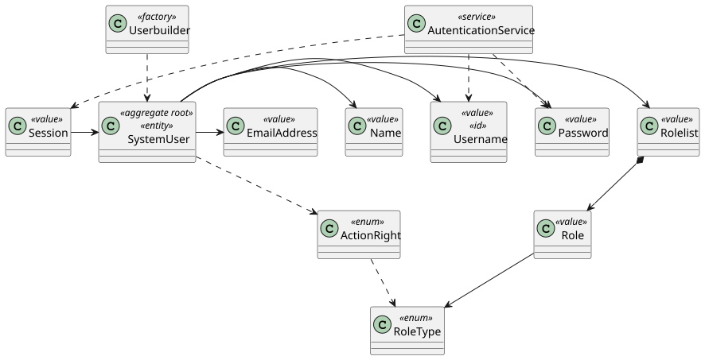
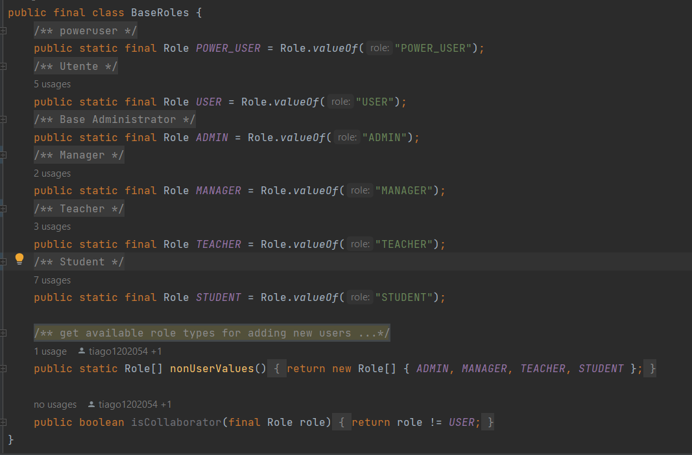
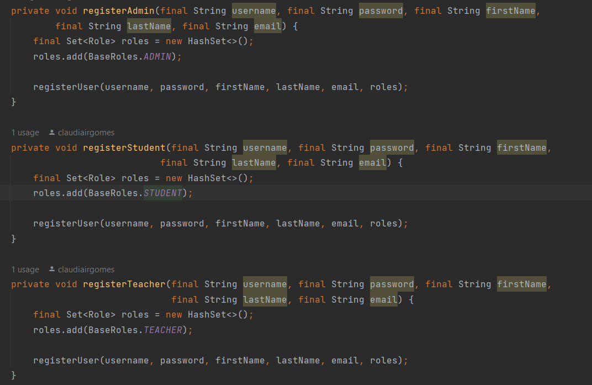

# US G006

## 1. Context

*As a Project Managers, I want the system to support and apply authentication and authorization for all its users and functionalities.*

## 2. Requirements

**US G002** 

- G002.1. Import the project "eapli.base"

- G002.2. Dependency: Data base creation

## 3. Analysis

The original foulder was adapted in agreement with the business context. 

## 4. Design

### 4.1. Realization

System Sequence Diagram

### 4.2. Class Diagram

### 4.3. Applied Patterns

## 5. Implementation

*After the insertion of the "eapli.base"  we just had to change the role identification tag, and refactor some methods for better business understanding*

Roles

Role Attribution

