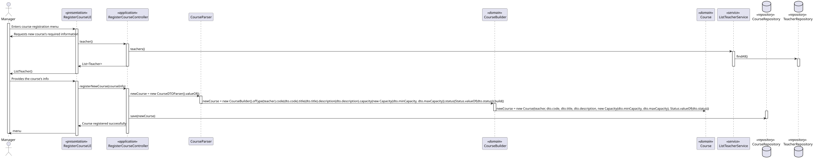
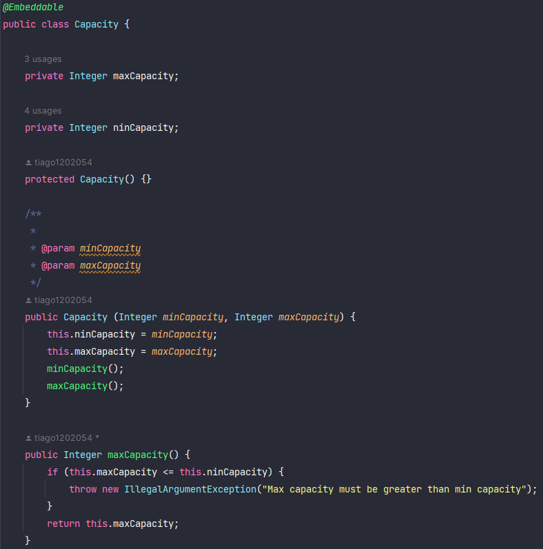
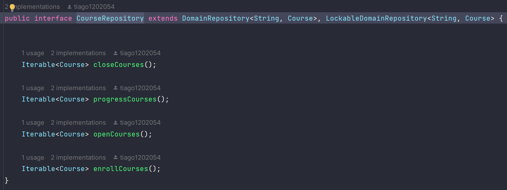

# US 1002


## 1. Context

*In this task, the manager has to create a course, taking into account the maximum and minimum number of accepted students, the course description, and the title according to business rules.*

## 2. Requirements

*Presentation of the functionality being developed*


**US G1002** As Manager, I want to create courses

- G1002.1. Solution design

- G1004.2. Solution implementation

*Regarding this requirement, we understand that it relates to the creation of a course by the manager, which must comply with the specified minimum and maximum number of students, as well as adhere to the course description and title according to business rules.*

## 3. Analysis

In this section, we report the study/analysis/comparison that was done to make the best design decisions for the requirement.

- The manager is responsible for creating the courses.
- The course has a title, a code, a description, a minimum and maximum number of students, and a state to indicate its status.
- The state starts as "Close".
- Only one manager is responsible for creating a course

## 4. Design

*This section presents the design of the solution that was adopted to solve the requirement.*

Using the standard base structure of the layered application.

Domain classes: Course

Values Objects: Status, Capacity

Controller: RegisterCourseViaDTOController

Repository: CourseRepository

Since course creation will be carried out by only one person, the likelihood of duplicates occurring is greatly reduced. Therefore, we have chosen to prioritize writing and consistency.

To develop this task, some patterns were used. In addition to Layered Architecture and Domain-Driven Design, we employed Service-Oriented Architecture (SOA), Container Architecture, Single Responsibility Principle, and the Factory Method pattern belonging to the Gang of Four (GoF) design patterns category.



### 4.1. Realization

### 4.2. Class Diagram
Use the standard application framework based on layers


### 4.3. Applied Patterns

### 4.4. Tests

tests are made for the case of success and failure and border
```
private final String aMecanographicNumber = "abc";
    private final String anotherMecanographicNumber = "xyz";

    public static SystemUser dummyUser(final String username, final Role... roles) {
        // should we load from spring context?
        final SystemUserBuilder userBuilder = new SystemUserBuilder(new NilPasswordPolicy(), new PlainTextEncoder());
        return userBuilder.with(username, "duMMy1", "dummy", "dummy", "a@b.ro").withRoles(roles).build();
    }

    private SystemUser getNewDummyUser() {
        return dummyUser("dummy", BaseRoles.ADMIN);
    }

    private SystemUser getNewDummyUserTwo() {
        return dummyUser("dummy-two", BaseRoles.TEACHER);
    }

    Teacher teacher = new Teacher(getNewDummyUserTwo(), new Acronym("ASD"), new TaxNumber("223925810"), new Date("12/12/1965"));
    Course course = new Course("Intro-Java-Sem01", "Java", "Programação Orientada Objetos", new Capacity(20,30), Status.CLOSE, teacher);
    @Test
    void sameAs() {
        Course course = new Course("Intro-Java-Sem01", "Java", "Programação Orientada Objetos", new Capacity(20,30), Status.CLOSE, teacher);
        assertTrue(course.sameAs(course));
    }

    @Test
    void sameAsInstance() {
        assertFalse(course.sameAs(teacher));
    }

    @Test
    void testEquals() {
        Course course = new Course("Intro-Java-Sem01", "Java", "Programação Orientada Objetos", new Capacity(20,30), Status.CLOSE, teacher);
        assertTrue(course.equals(course));
    }

    @Test
    void failTestEquals() {
        Course course = new Course("Intro-Java-Sem01", "Java", "Programação", new Capacity(20,30), Status.CLOSE, teacher);
        assertTrue(course.equals(course));
    }

    @Test
    void testHashCode() {
    }

    @Test
    void identity() {
        String expected = "Java";
        assertEquals(expected, course.identity());
    }

    @Test
    void failIdentity() {
        String expected = "Java1";
        assertNotEquals(expected, course.identity());
    }

    @Test
    void toDTO() {
        CourseDTO courseDTO = new CourseDTO("Java","Intro-Java-Sem01", "Programação Orientada Objetos", 20, 30, "CLOSE", "ASD","223925810");
        assertEquals(courseDTO, course.toDTO());
    }

    @Test
    void failtoDTO() {
        CourseDTO courseDTO = new CourseDTO("Java","Intro-Java-Sem01", "Programação Orientada Objetos", 20, 30, "CLOSE", "ASD","223925810");
        assertEquals(courseDTO, course.toDTO());
    }

    @Test
    void status() {
        Status expected = Status.CLOSE;
        assertEquals(expected, course.status());
    }

    @Test
    void failStatus() {
        Status expected = Status.OPEN;
        assertNotEquals(expected, course.status());
    }

    @Test
    void statusEntity() {
        Status expected = Status.OPEN;
        assertEquals(expected, course.status(Status.OPEN));
    }

    @Test
    void failStatusEntity() {
        Status expected = Status.ENROLL;
        assertNotEquals(expected, course.status(Status.OPEN));
    }

    @Test
    void title() {
        String expected = "Intro-Java-Sem01";
        assertEquals(expected, course.title());
    }

    @Test
    void failtitle() {
        String expected = "Intro-Java-Sem01";
        assertEquals(expected, course.title());
    }
````

## 5. Implementation

The `AggregateRoot` has been implemented in the `Course` class, and the framework's `ValueObject` has been implemented in the value objects.

## class Course


## class Status


## class Capacity



## controller


## repository



## 6. Integration/Demonstration


## 7. Observations

When creating a course, it must be immediately associated with a headTeacher.