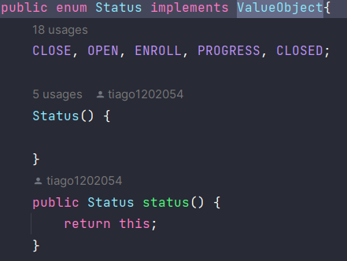

# US 1004


## 1. Context

*In this task, As Manager, I want to open and close courses*

## 2. Requirements

*Presentation of the functionality being developed*


**US G1004**As Manager, I want to open and close courses

- G1004.1. Solution design

- G1004.2. Solution implementation

*Regarding this requirement, we understand that it is a matter of opening or closing a course, taking into account the previous status of the course.*

## 3. Analysis

In this section, we report the study/analysis/comparison that was done to make the best design decisions for the requirement.

- The manager is responsible for opening or closing the course.
- To open the course, it must be in the closed state.
- To close the course, it must be in the progress state.
- We chose to divide it into two use cases, one for opening and the other for closing.

## 4. Design

*This section presents the design of the solution that was adopted to solve the requirement.*

Using the standard base structure of the layered application.

Domain classes: Course

Values Objects: Status, Capacity

Controller: OpenCourseController, CloseCourseController

Repository: CourseRepository

As changing the status of the course will be performed by only one person, the likelihood of duplicates occurring is greatly reduced. Therefore, we chose to prioritize writing and consistency.

To develop this task, some patterns were used. In addition to Layered Architecture and Domain-Driven Design, we employed Service-Oriented Architecture (SOA), Container Architecture, Single Responsibility Principle, and the Factory Method pattern belonging to the Gang of Four (GoF) design patterns category.


### 4.1. Realization

### 4.2. Class Diagram
Use the standard application framework based on layers


### 4.3. Applied Patterns

### 4.4. Tests

tests are made for the case of success and failure and border

```
 @Test
    void status() {
        Status status = Status.CLOSE;
        assertEquals(Status.CLOSE, status.status());
    }

    @Test
    void failstatus() {
        Status status = Status.CLOSE;
        assertNotEquals(Status.OPEN, status.status());
    }

    @Test
    void open() {
        Status status = Status.OPEN;
        assertEquals(Status.OPEN, status.open());
    }

    @Test
    void isClose() {
        Status status = Status.CLOSE;
        assertTrue(status.isClose());
    }

    @Test
    void failIsClose() {
        Status status = Status.CLOSED;
        assertFalse(status.isClose());
    }

    @Test
    void isProgress() {
        Status status = Status.PROGRESS;
        assertTrue(status.isProgress());
    }

    @Test
    void failIsProgress() {
        Status status = Status.OPEN;
        assertFalse(status.isProgress());
    }

    @Test
    void openCourses() {
        Status status = Status.OPEN;
        assertTrue(status.openCourses());
    }

    @Test
    void failOpenCourses() {
        Status status = Status.PROGRESS;
        assertFalse(status.openCourses());
    }

    @Test
    void enrollCourses() {
        Status status = Status.ENROLL;
        assertTrue(status.enrollCourses());
    }

    @Test
    void failEnrollCourses() {
        Status status = Status.ENROLL;
        assertTrue(status.enrollCourses());
    }
    @Test
    void testToString() {
        Status status = Status.CLOSE;
        assertEquals("CLOSE", status.toString());
    }

    @Test
    void FailtestToString() {
        Status status = Status.CLOSE;
        assertNotEquals("OPEN", status.toString());
    }
````

## 5. Implementation

The `AggregateRoot` has been implemented in the `Course` class, and the framework's `ValueObject` has been implemented in the value objects.

## class Course


## class Status



## controller


## 6. Integration/Demonstration


## 7. Observations

All the documentation was thought in the division of the two use cases

To open the course, it must be in the closed state.

To close the course, it must be in the progress state.