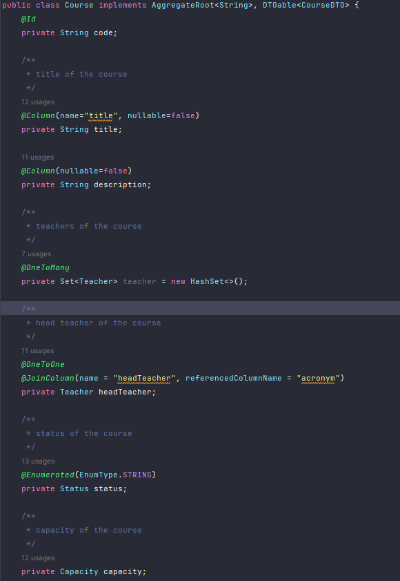
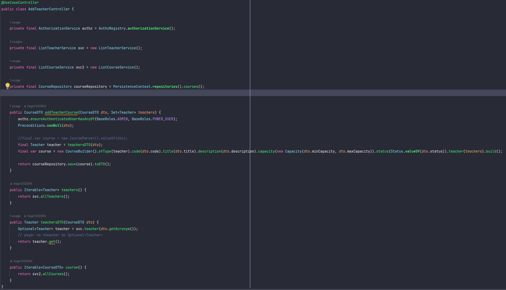

# US 1005


## 1. Context

*In this task, as Manager, I want to set the teachers of a course*
## 2. Requirements

*In this section you should present the functionality that is being developed, how do you understand it, as well as possible correlations to other requirements (i.e., dependencies).*

*Example*

**US G1005** I want to set the teachers of a course

- G1005.1. Solution design

- G1005.2. Solution implementation

*Regarding this requirement, we understand that it is about adding professors, who will teach classes, to a course by the manager*

## 3. Analysis

*This section presents the design of the solution that was adopted to solve the requirement.*

Using the standard base structure of the layered application.

Domain classes: Course

Values Objects: Status, Capacity

Controller: RegisterCourseViaDTOController

Repository: CourseRepository

As adding professors to a course will be done by only one person, the likelihood of duplicates occurring is greatly reduced. Therefore, we chose to prioritize writing and consistency.

To develop this task, some patterns were used. In addition to Layered Architecture and Domain-Driven Design, we employed Service-Oriented Architecture (SOA), Container Architecture, Single Responsibility Principle, and the Factory Method pattern belonging to the Gang of Four (GoF) design patterns category.


## 4. Design

*In this sections, the team should present the solution design that was adopted to solve the requirement. This should include, at least, a diagram of the realization of the functionality (e.g., sequence diagram), a class diagram (presenting the classes that support the functionality), the identification and rational behind the applied design patterns and the specification of the main tests used to validade the functionality.*

### 4.1. Realization

### 4.2. Class Diagram
Use the standard application framework based on layers


### 4.3. Applied Patterns

### 4.4. Tests

**Test 1:** *Verifies that it is not possible to create an instance of the Example class with null values.*

```
 @Test
    void teacher() {
        HashSet teacherSet = new HashSet();
        teacherSet.add(teacher);
        teacherSet.add(teacherTwo);
        assertSame(courseBuilder, courseBuilder.teacher(teacherSet));
    }

    @Test
    void failTeacher() {
        HashSet teacherSet = new HashSet();
        teacherSet.add(teacher);
        CourseBuilder courseBuilder1 = new CourseBuilder();
        assertNotSame(courseBuilder1, courseBuilder.teacher(teacherSet));
    }
````

## 5. Implementation

The `AggregateRoot` has been implemented in the `Course` class, and the framework's `ValueObject` has been implemented in the value objects.

## class Course



## controller



## 6. Integration/Demonstration


## 7. Observations

Teachers and courses must already exist in the system.