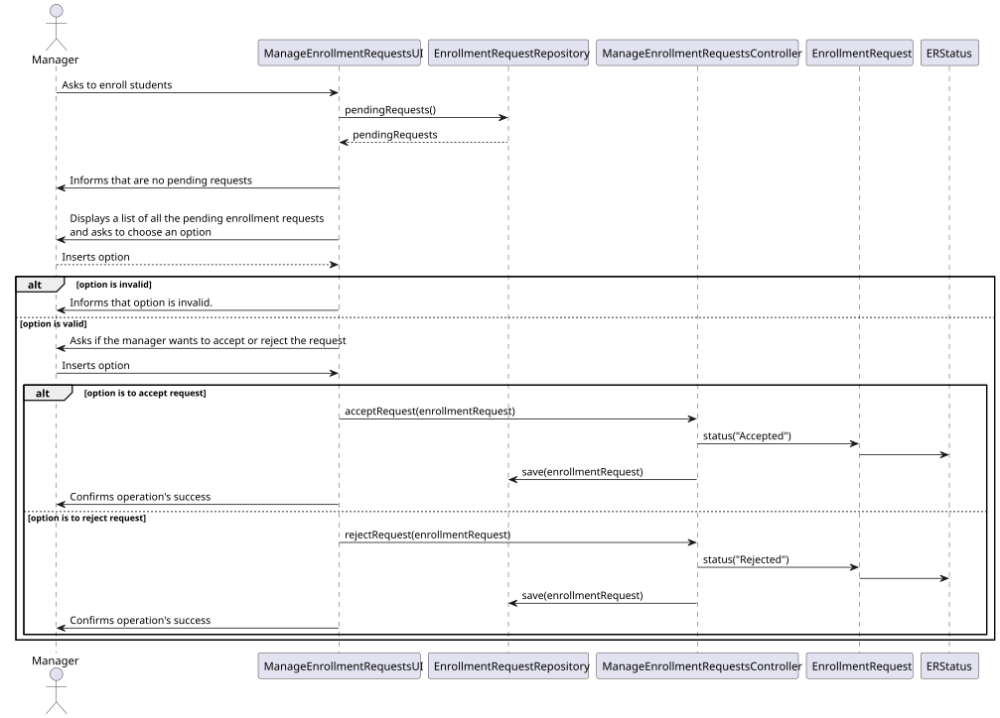
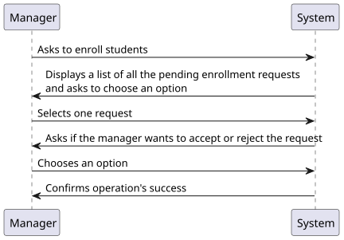
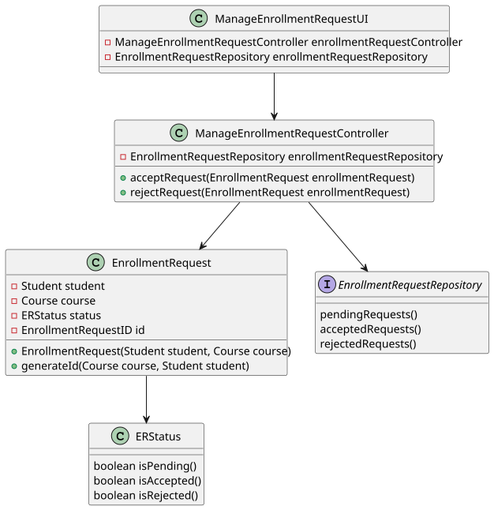

# US 3004

*As Manager, I want to approve or reject students applications to courses*

## 1. Context

*This is the first time the task has been developed. In this task, a manager accepts or rejects students enrollment requests to a course*


## 2. Requirements

*Presentation of the functionality being developed*


**US G1009** As Manager, I want to approve or reject students applications to courses

- G1009.1. Solution design

- G1009.2. Solution implementation

*Regarding this requirement, we understand that it relates to a student requesting to enroll in a course*

## 3. Analysis

*In this section, the team should report the study/analysis/comparison that was done in order to take the best design decisions for the requirement. This section should also include supporting diagrams/artifacts (such as domain model; use case diagrams, etc.),*

- All managers are able to accept or reject students applications
- Only pending requests are shown to the manager
- When a student's application is accepted, he is registered in the selected course

## 4. Design

*This section presents the design of the solution that was adopted to solve the requirement.*

Using the standard base structure of the layered application.

Domain classes: EnrollmentRequest

Controller: ManageEnrollmentRequestsController

Repository: EnrollmentRequestRepository

### 4.1. Realization



### 4.2. Class Diagram



### 4.3. Applied Patterns

To develop this task, some patterns were used. In addition to Layered Architecture and Domain-Driven Design, we employed Service-Oriented Architecture (SOA), Container Architecture, Single Responsibility Principle, and the Factory Method pattern belonging to the Gang of Four (GoF) design patterns category.


### 4.4. Tests

**Test 1:** *Verifies that it is not possible to create an instance of the Example class with null values.*

```
@Test(expected = IllegalArgumentException.class)
public void ensureNullIsNotAllowed() {
	Example instance = new Example(null, null);
}
````

## 5. Implementation

*In this section the team should present, if necessary, some evidencies that the implementation is according to the design. It should also describe and explain other important artifacts necessary to fully understand the implementation like, for instance, configuration files.*

*It is also a best practice to include a listing (with a brief summary) of the major commits regarding this requirement.*

## 6. Integration/Demonstration

*In this section the team should describe the efforts realized in order to integrate this functionality with the other parts/components of the system*

*It is also important to explain any scripts or instructions required to execute an demonstrate this functionality*

## 7. Observations

*This section should be used to include any content that does not fit any of the previous sections.*

*The team should present here, for instance, a critical prespective on the developed work including the analysis of alternative solutioons or related works*

*The team should include in this section statements/references regarding third party works that were used in the development this work.*