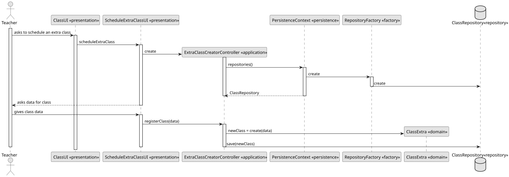
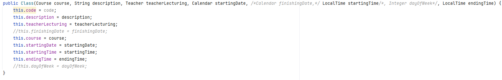
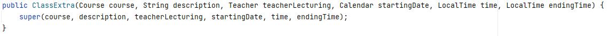
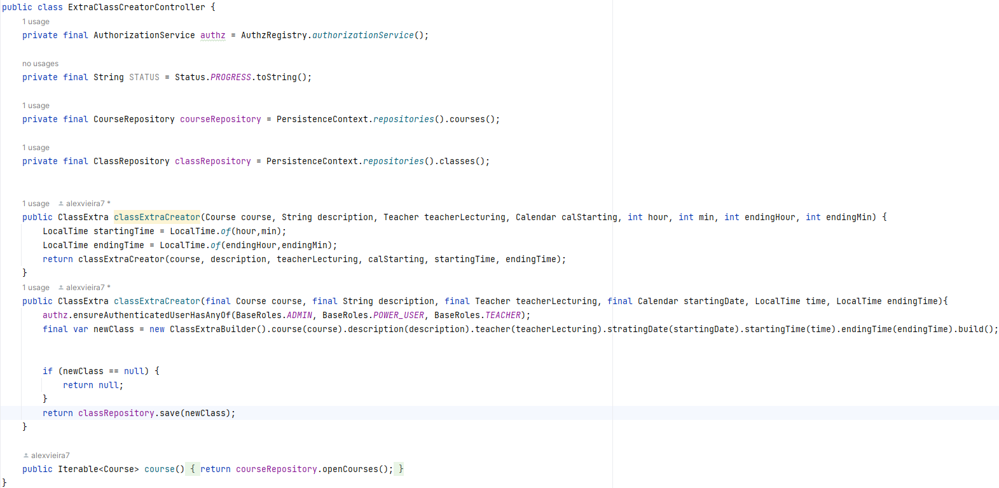
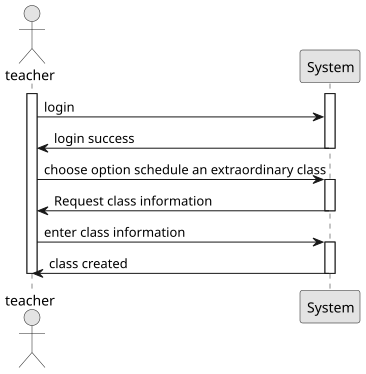

# US 1011 - As a Teacher, I want to schedule an extraordinary class


## 1. Context

This component of the system intends to implement a functionality that allows the teacher to schedule an Extraordinary Class,
taking into account the starting time, finishing time, starting date, finishing date and teacher lecturing, always 
following the business concepts.


## 2. Requirements

**US G1011** As Teacher, I want to schedule an extraordinary class

- G1011.1. This requirement involves the development of functionality that allows teacher to schedule an extraordinary class.

- G1011.2. Implementation of the functionality that should be done in a way that respects the business concepts.


## 3. Analysis

The analysis for the requirement "As Teacher, I want to schedule an extraordinary class" involves studying the existing business concepts and identifying the key elements and constraints related to scheduling a class. The analysis aims to determine the design decisions that will best fulfill the requirement while aligning with the overall system architecture.

To start the analysis, we can consider the following points:

**Class Scheduling:** The primary objective is to enable teachers to schedule classes. This implies that the system should provide a user interface through which teachers can input the necessary details such as starting time, finishing time, starting date, and finishing date for each class.

**Extraordinary Classes:** The requirement mentions scheduling an extraordinary class, which suggests that teachers should have the ability to schedule classes that repeat on specific days or at regular intervals. This could be achieved by allowing teachers to select the days of the week on which the class should be scheduled or specifying a recurrence pattern (e.g., daily, weekly, monthly).

**Business Constraints:** The requirement emphasizes the importance of respecting business concepts. This indicates that there might be specific rules or constraints associated with class scheduling, such as limitations on the number of classes a teacher can schedule in a given time period or restrictions on overlapping class timings.


## 4. Design



### 4.1. Realization

Based on the above analysis, we can propose a high-level design for the class scheduling functionality. Here is an outline of the design decisions:

**User Interface:** Develop a user-friendly interface that allows teachers to input class details such as time, date, and recurrence options. This interface should provide validation and feedback to ensure that the entered information adheres to the business rules.

**Conflict Resolution:** Implement a mechanism to handle conflicts that may arise when scheduling classes. This could involve checking for overlapping time slots and providing notifications or suggestions to the teacher to resolve the conflicts.

**Business Rule Enforcement:** Incorporate the necessary business rules and constraints related to class scheduling. This could include limits on the number of classes a teacher can schedule within a certain time frame, restrictions on class duration, or other relevant constraints.

### 4.2. Class Diagram

### 4.3. Applied Patterns

**Builder Pattern:** The Builder pattern can be employed to create complex class schedule objects. The class schedule builder encapsulates the construction logic and provides a step-by-step approach to creating a class schedule. This pattern allows for flexible and extensible creation of schedule objects, enabling teachers to set various parameters such as starting time, finishing time, dates, and recurrence options while ensuring the business constraints are enforced.

**Iterator Pattern:** The Iterator pattern can be beneficial when working with recurring class schedules. This pattern provides a way to iterate over a collection of classes, especially in cases where there are multiple occurrences of a class based on recurrence rules. The iterator allows the system to retrieve and present the scheduled classes in a sequential manner, simplifying operations such as displaying the upcoming classes or checking for conflicts.

### 4.4. Tests

**Test 1:** *Verifies starting time.*

```
    @Test
    public void testStartingTime() throws Exception {
        ClassBuilder result = classBuilder.startingTime(LocalTime.of(10, 55, 43));
        Assert.assertEquals(classBuilder.startingTime(startingTime), result);
    }
````

**Test 2:** *Verifies finishing time.*

```
    @Test
    public void testFinishingTime() throws Exception {
        ClassBuilder result = classBuilder.finishingTime(LocalTime.of(10, 55, 43));
        Assert.assertEquals(classBuilder.finishingTime(finishingTime), result);
    }
````

**Test 3:** *Verifies starting date.*

```
    @Test
    public void testStartingDate() throws Exception {
        ClassBuilder result = classBuilder.startingDate(LocalDate.of(2021, 10, 10));
        Assert.assertEquals(classBuilder.startingDate(startingDate), result);
    }
````

## 5. Implementation
The `AggregateRoot` has been implemented in the `Class` class, and the framework's `ValueObject` has been implemented in the value objects.







## 6. Integration/Demonstration



## 7. Observations

No specific observations provided