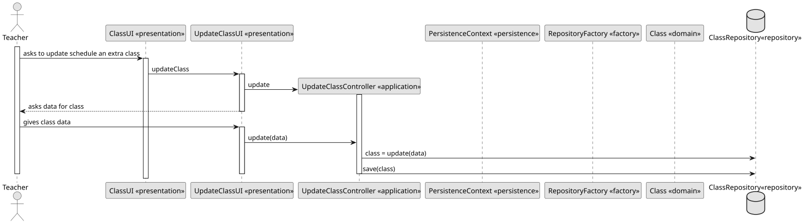
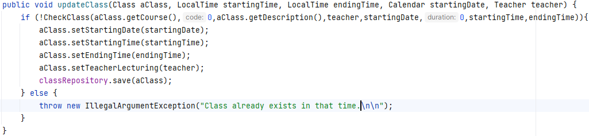
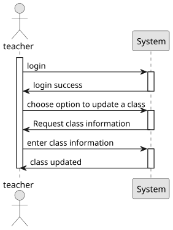

# US 1012 - As a Teacher, I want to update the schedule of a class


## 1. Context

This component of the system intends to implement a functionality that allows the teacher to update a Class,
taking into account the starting time, finishing time, starting date, finishing date and teacher lecturing, always
following the business concepts.


## 2. Requirements

**US G1012** As Teacher, I want to update the schedule of a class

- G1012.1. This requirement involves the development of functionality that allows teacher to update the schedule of a class.

- G1012.2. Implementation of the functionality that should be done in a way that respects the business concepts.

## 3. Analysis

To analyze the requirement, we can consider the following points:

**Schedule Update Functionality:** The primary objective is to provide teachers with the ability to update the schedule of a class. This implies that the system should allow teachers to modify the starting time, finishing time, starting date, and finishing date for a class.

**Business Concepts and Constraints:** It's crucial to consider the business rules and constraints related to class scheduling. This may include limitations on changing the schedule within a specific time frame, rules regarding overlapping schedules, and other constraints that ensure the integrity and coherence of the class schedule.

## 4. Design



### 4.1. Realization

Based on the above analysis, we can propose a high-level design for the class scheduling functionality. Here is an outline of the design decisions:

**User Interface:** Develop a user-friendly interface that allows teachers to view and update the schedule of their classes. The interface should provide the necessary fields to modify the starting time, finishing time, starting date, and finishing date. Additionally, it should display any relevant information or warnings regarding business constraints.

**Validation and Conflict Resolution:** Implement validation checks to ensure that the updated schedule adheres to the business rules. This includes checking for conflicts with other classes or events, verifying that the modified schedule falls within permissible timeframes, and handling any potential conflicts or overlaps appropriately.

### 4.2. Class Diagram

### 4.3. Applied Patterns

**Builder Pattern:** The Builder pattern can be employed to create complex class schedule objects. The class schedule builder encapsulates the construction logic and provides a step-by-step approach to creating a class schedule. This pattern allows for flexible and extensible creation of schedule objects, enabling teachers to set various parameters such as starting time, finishing time, dates, and recurrence options while ensuring the business constraints are enforced.

**Iterator Pattern:** The Iterator pattern can be beneficial when working with recurring class schedules. This pattern provides a way to iterate over a collection of classes, especially in cases where there are multiple occurrences of a class based on recurrence rules. The iterator allows the system to retrieve and present the scheduled classes in a sequential manner, simplifying operations such as displaying the upcoming classes or checking for conflicts.

### 4.4. Tests

**Test 1:** *Verifies starting time.*

```
    @Test
    public void testStartingTime() throws Exception {
        ClassBuilder result = classBuilder.startingTime(LocalTime.of(10, 55, 43));
        Assert.assertEquals(classBuilder.startingTime(startingTime), result);
    }
````

**Test 2:** *Verifies finishing time.*

```
    @Test
    public void testFinishingTime() throws Exception {
        ClassBuilder result = classBuilder.finishingTime(LocalTime.of(10, 55, 43));
        Assert.assertEquals(classBuilder.finishingTime(finishingTime), result);
    }
````

**Test 3:** *Verifies starting date.*

```
    @Test
    public void testStartingDate() throws Exception {
        ClassBuilder result = classBuilder.startingDate(LocalDate.of(2021, 10, 10));
        Assert.assertEquals(classBuilder.startingDate(startingDate), result);
    }
````

## 5. Implementation
The `AggregateRoot` has been implemented in the `Class` class, and the framework's `ValueObject` has been implemented in the value objects.



## 6. Integration/Demonstration



## 7. Observations

No specific observations.