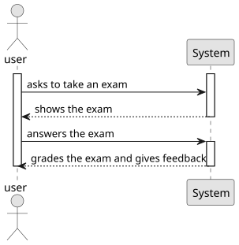
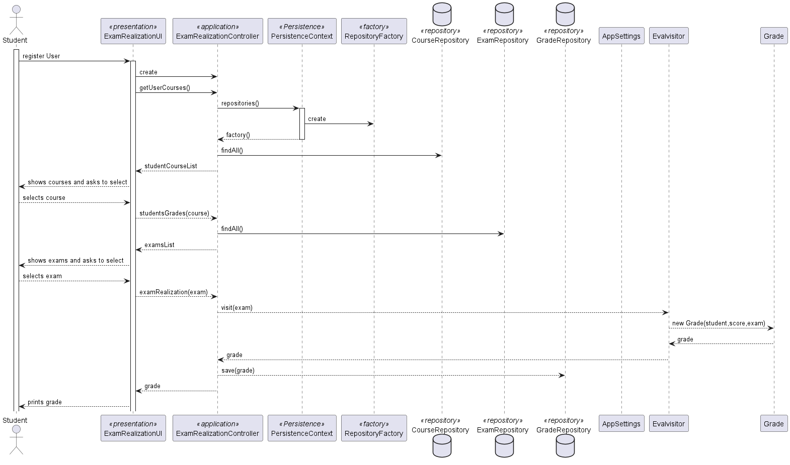
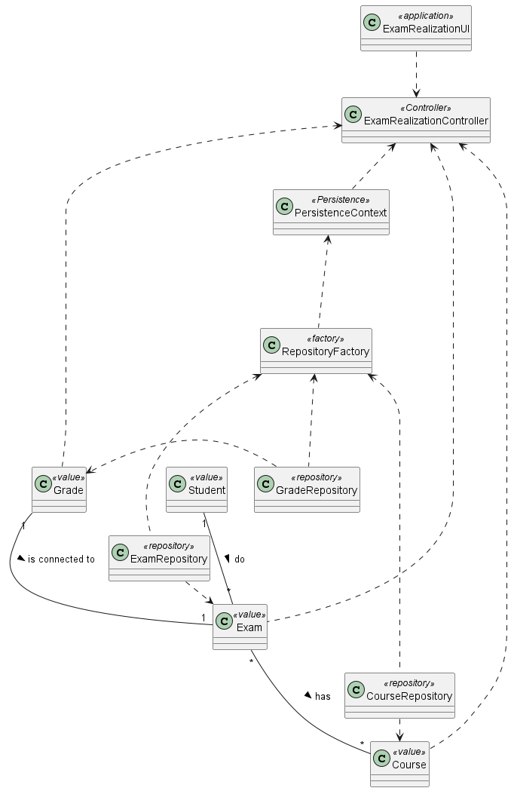

# US 2004 - As Student, I want to take an exam 


## 1. Context

A Student takes an exam and answer its questions.
At the end of the exam, the system should display the feedback and result (i.e., grade) of the exam.
The feedback and grade of the exam should be automatically calculated by a parser based on the grammar defined for exams structure.

## 2. Requirements

**US 2004** As Student, I want to take an exam

- 2004.1. This requirement involves the development of functionality that allows students to take an exam and grade it automatically.

- 2004.2. The implementation must take into account the feedback and grade of the exam should be automatically calculated by a parser based on the grammar defined for exams structure.

Regarding this requirement we understand that it relates to the past User Story, given on Sprint B, ["As Teacher, I want to create/update an exam"](../us_2001) 

## 3. Analysis

In order to address the requirement of allowing students to take an exam and grade it automatically, our team conducted a thorough analysis of the necessary components and design considerations. The primary focus was on developing a system that accurately evaluates student answers based on the grammar defined for exam structures.

During our analysis, we examined the structure of the exam and identified different types of questions such as multiple choice, fill in the blanks, and essay questions. We also considered how the answers are recorded, whether through checkboxes, text inputs, or other means. Understanding the exam structure was crucial for designing the system's capabilities to handle various question types and answer formats.

Another important aspect of our analysis was defining the grammar for evaluating the answers. We established rules for assigning weights to different question types, specifying correct answers, and determining the criteria for grading subjective questions. By defining these grammar rules, we ensured that the grading process would be consistent and objective across different exams.

Feedback and grading were key considerations as well. We determined how the system should provide feedback to students, including a breakdown of scores for different sections or question types. We also aimed to highlight correct and incorrect answers, along with overall comments on the performance. By designing an informative and comprehensive feedback system, we aimed to enhance the learning experience for students and help them understand their strengths and areas for improvement.

In terms of user interface, we focused on creating an intuitive and user-friendly exam-taking functionality. Students should be able to navigate through the exam easily, provide their answers efficiently, and submit the exam for grading without any confusion or difficulty. Clear instructions, error handling, and validation were incorporated into the design to ensure a smooth and seamless user experience.

Based on our analysis, we designed the system to include components such as the Exam Interface, Answer Recorder, Parser, and Grader. These components work together to facilitate the exam-taking process, record and evaluate student answers, and provide feedback and grading results.

By thoroughly analyzing the technical requirements, exam structure, grammar for evaluation, feedback and grading needs, and user interface considerations, we believe our proposed solution will effectively meet the requirements of allowing students to take an exam and automatically grade their answers.



## 4. Design



### 4.1. Realization

During the realization phase of the exam-taking and grading functionality, we addressed several key aspects:

**Exam Structure:** We thoroughly understood the structure of the exam, including the various question types such as multiple choice, fill in the blanks, and essay questions. We also considered the possible options for each question type and how the answers would be recorded. For example, checkboxes and text inputs were used to record the answers. This understanding of the exam structure helped in designing the components and algorithms to handle different question types and answer formats effectively.

**Grammar for Evaluation:** We defined the grammar rules for evaluating the answers based on the exam structure. This involved assigning appropriate weights to different question types to reflect their importance in the overall grade. We specified the correct answers for each question and determined the grading criteria for subjective questions and essays. By establishing these grammar rules, we ensured a consistent and fair evaluation process.

**Feedback and Grading:** We designed the system to provide comprehensive feedback and grading to the students. The feedback included a breakdown of scores for different sections or question types, allowing students to identify their strengths and weaknesses. We also highlighted correct and incorrect answers, providing students with immediate feedback on their performance. Furthermore, we incorporated the capability to provide overall comments on the performance, enabling personalized feedback for each student.

**User Interface:** The user interface for the exam-taking functionality was carefully designed to provide a seamless and intuitive experience for students. We ensured that students could easily navigate through the exam, providing answers efficiently. Clear instructions were provided at each step, guiding students through the process. The interface was designed to handle errors and validation issues effectively, providing informative error messages and preventing any unintended submission errors.

By addressing the exam structure, grammar for evaluation, feedback and grading requirements, and user interface design, we were able to realize the exam-taking and grading functionality effectively. The system accurately recorded and evaluated student answers based on the defined grammar rules, providing detailed feedback and grades. The user interface facilitated a user-friendly experience, allowing students to navigate through the exam smoothly and submit their answers confidently.

### 4.2. Class Diagram



### 4.3. Applied Patterns

**Incorrect Answer:**

- Description: A test case where the student provides an incorrect answer to a multiple choice question.
- Test Steps: Present the multiple choice question with options A, B, C, and D.
The student selects option C as the answer.  Submit the exam.
Expected Result:
- The system parses the answer, identifies that option C is incorrect, and assigns the appropriate weight to the question.
- The system provides feedback indicating that the answer was incorrect.
- The system calculates the overall grade considering the weight of the question.

### 4.4. Tests

**Test 1:** *Verifies that it is not possible to create an instance of the Example class with null values.*

```
@Test(expected = IllegalArgumentException.class)
public void ensureNullIsNotAllowed() {
	Example instance = new Example(null, null);
}
````

## 5. Implementation


## 6. Integration/Demonstration

*In this section the team should describe the efforts realized in order to integrate this functionality with the other parts/components of the system*

*It is also important to explain any scripts or instructions required to execute an demonstrate this functionality*

## 7. Observations

*This section should be used to include any content that does not fit any of the previous sections.*

*The team should present here, for instance, a critical prespective on the developed work including the analysis of alternative solutioons or related works*

*The team should include in this section statements/references regarding third party works that were used in the development this work.*