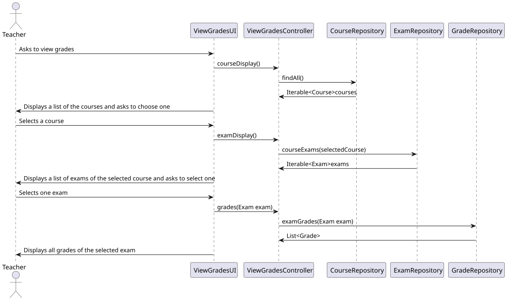
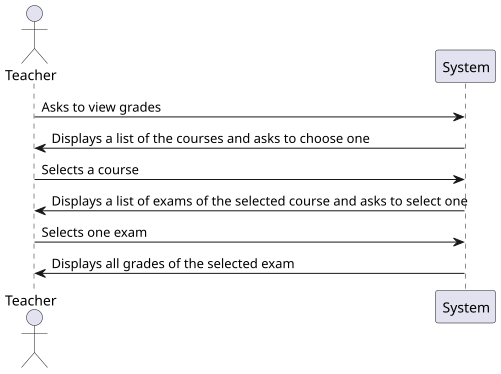
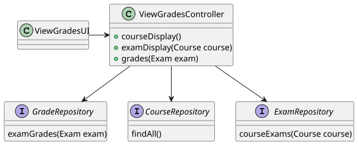

# US 2006

*As Teacher, I want to view a list of the grades of exams in my courses*

## 1. Context

*This is the first time the task has been developed. In this task, a teacher views a list of the grades of a specified exam of a specific course*

## 2. Requirements

*Presentation of the functionality being developed*

**US G2006** As Teacher, I want to view a list of the grades of exams in my courses

- G2006.1. Solution design

- G2006.2. Solution implementation

*Regarding this requirement, we understand that it relates to the creation of exams, attribution of grades*

## 3. Analysis

*In this section, the team should report the study/analysis/comparison that was done in order to take the best design decisions for the requirement. This section should also include supporting diagrams/artifacts (such as domain model; use case diagrams, etc.),*

- Teachers are able to see the grades of any course

## 4. Design

*This section presents the design of the solution that was adopted to solve the requirement.*

Using the standard base structure of the layered application.

Domain classes: Grades

Controller: ViewGradesController

Repository: GradeRepository

### 4.1. Realization

### 4.2. Class Diagram

### 4.3. Applied Patterns

To develop this task, some patterns were used. In addition to Layered Architecture and Domain-Driven Design, we employed Service-Oriented Architecture (SOA), Container Architecture, Single Responsibility Principle, and the Factory Method pattern belonging to the Gang of Four (GoF) design patterns category.

