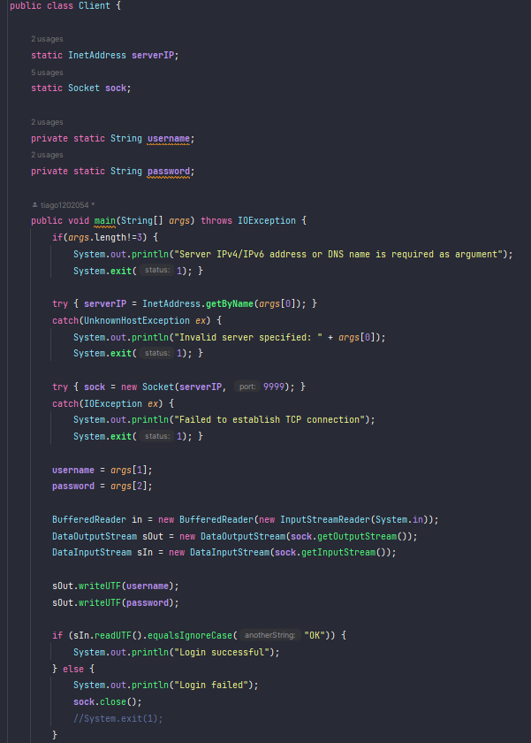
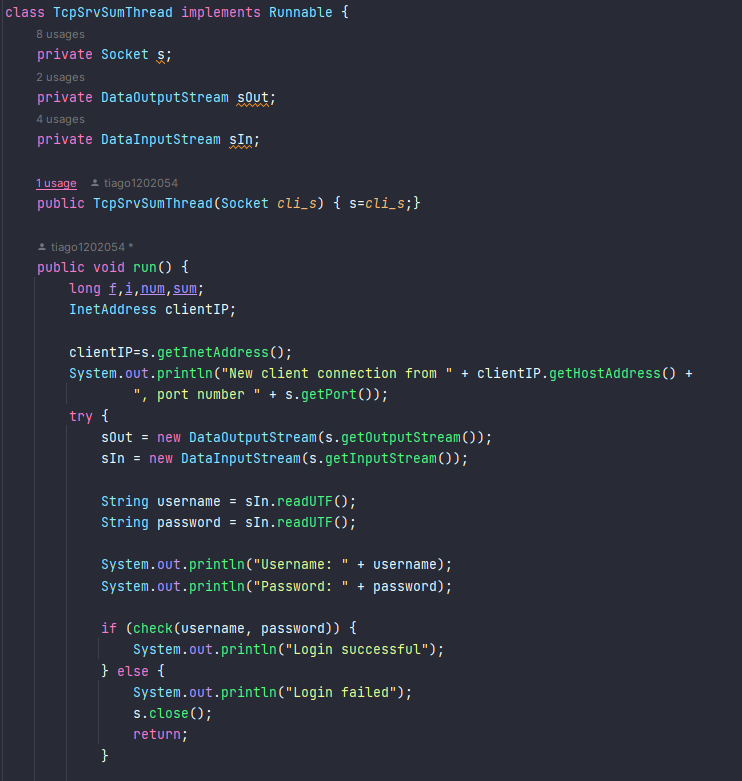
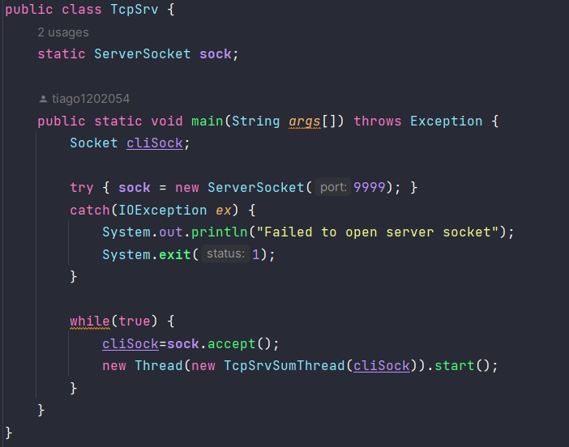

# US 3001

## 1. Context

*In this task, As Project Manager, I want the team to prepare the communication infrastruture for the Shared Boards and the depoyment of the solution.*
## 2. Requirements

*In this section you should present the functionality that is being developed, how do you understand it, as well as possible correlations to other requirements (i.e., dependencies).*

*Example*

**US G3001** I want the team to prepare the communication infrastruture for the Shared Boards and the depoyment of the solution.

- G3001.1. Solution design

- G3001.2. Solution implementation

## 3. Analysis

In this section, we report the study/analysis/comparison that was done to make the best design decisions for the requirement.

- The client must enter the IP address to establish the connection with the server and then provide their access credentials. 
- The server is responsible for verifying those credentials.
 
## 4. Design

Class TcpSrvSumThread:

- Responsible for handling the processing logic of each client connected to the server.
- Implements the Runnable interface, allowing it to be executed in a separate thread for each client.
- Has a constructor that receives the Socket object representing the connection with the client.
- In the run() method, it obtains the client's IP address and port number and prints them.
- Creates DataOutputStream and DataInputStream objects to send and receive data from the client.

Class Client:

- Responsible for implementing the client code to interact with the server.
- Has a main method as the entry point of the client application.
- Receives three command-line arguments: server IP address (or DNS name), username, and password.
- Establishes a TCP connection with the server using the IP address and port 9999.
- Sets up input and output streams for communication with the server.
- Sends the username and password to the server.
- Reads the response from the server and displays a login success or failure message.

The TCP/IP (Transmission Control Protocol/Internet Protocol) was used: It is a combination of two protocols that work together to provide communication in computer networks. TCP is responsible for the transmission control of data, while IP is responsible for addressing and routing packets on the Internet.

## Tests

This type of test is performed in practice. To do this, you need to run the server and then the client so that you can enter the IP address to establish the TCP/IP connection, followed by the access credentials for verification.

- To test connection failure, you simply need to enter an invalid IP address that is not associated with the server. The same applies to testing access credentials.

- To test for success, you should enter the access credentials and IP address correctly.

## 5. Implementation

## Client

## Server

## TcpServer

## 6. Integration/Demonstration

To use the provided classes, the user should follow these steps:

1. Start the server:
    - Execute the compiled `TcpSrvSumThread` class. This will start the server and make it ready to accept client connections.

3. Start the client:
    - Execute the compiled `Client` class, providing the required command-line arguments:
        - Server IPv4/IPv6 address: Specify the IP address of the server where the `TcpSrvSumThread` is running.
        - Username: Provide the username for authentication.
        - Password: Enter the password corresponding to the username.

4. Interact with the client:
    - The client will establish a TCP connection with the server and prompt you for input.
   
5. Terminate the client and server:
    - The client will close the socket connection and exit.

## 7. Observations
The implementation was based on the code provided in RCOMP classes.