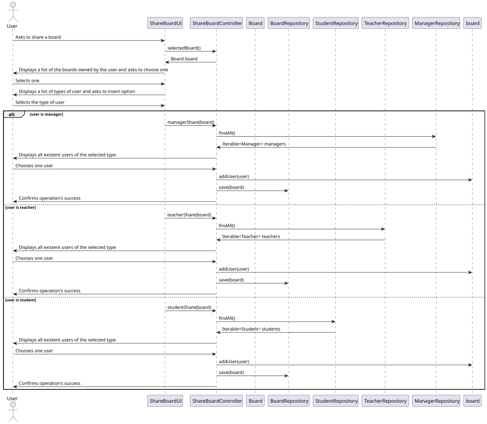
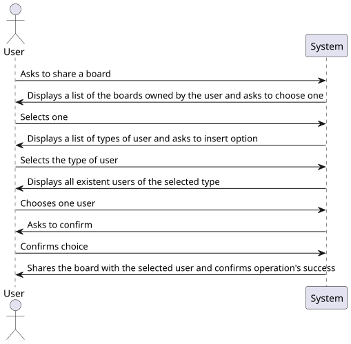
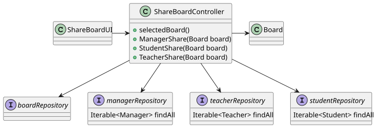

# US 3004

*As User, I want to share a board*

## 1. Context

*This is the first time the task has been developed. In this task, the user has to share a board it owns with other users.*


## 2. Requirements

*Presentation of the functionality being developed*


**US G3004** As User, I want to share a board

- G3004.1. Solution design

- G3004.2. Solution implementation

*Regarding this requirement, we understand that it relates to the creation of a board by a user*

## 3. Analysis

*In this section, the team should report the study/analysis/comparison that was done in order to take the best design decisions for the requirement. This section should also include supporting diagrams/artifacts (such as domain model; use case diagrams, etc.),*

- All users are able to share a board.
- Users are only able to share boards they own.

## 4. Design

*This section presents the design of the solution that was adopted to solve the requirement.*

Using the standard base structure of the layered application.

Domain classes: Board

Controller: ShareBoardController

Repository: BoardRepository

### 4.1. Realization



### 4.2. Class Diagram



### 4.3. Applied Patterns

To develop this task, some patterns were used. In addition to Layered Architecture and Domain-Driven Design, we employed Service-Oriented Architecture (SOA), Container Architecture, Single Responsibility Principle, and the Factory Method pattern belonging to the Gang of Four (GoF) design patterns category.


### 4.4. Tests

**Test 1:** *Verifies that it is not possible to create an instance of the Example class with null values.*

```
        @Test
        void sameAs() {
            Board board1 = new Board("Titulo",rowsSet,columnSet,null,owner(),systemUsers);
            assertTrue(board1.sameAs(board));
        }

        @Test
        void sameAsInstance() {
            assertFalse(board.sameAs(owner()));
        }

        @Test
        void testEquals() {
            Board board1 = new Board("Titulo",rowsSet,columnSet,null,owner(),systemUsers);
            assertTrue(board1.equals(board));
        }

        @Test
        void failTestEquals() {
            Board board1 = new Board("Diferente",rowsSet,columnSet,null,owner(),systemUsers);
            assertFalse(board1.equals(board));
        }


        @Test
        void title() {
            String expected = "Titulo";
            assertEquals(expected, board.getBoardTitle());
        }

    @Test
    void failtitle() {
        String expected = "Diferente";
        assertNotEquals(expected, board.getBoardTitle());
    }
    
    @Test
    public void equals(){
        Column column1 = new Column("coluna",1);
        assertEquals(column1,column);
    }

    @Test
    public void equalsFails(){
        Column column1 = new Column("diferente",2);
        assertNotEquals(column1,column);
    }
    @Test
    public void equalsFailsTitle(){
        Column column1 = new Column("diferente",1);
        assertNotEquals(column1,column);
    }

    @Test
    public void equalsFailsPosition(){
        Column column1 = new Column("coluna",2);
        assertNotEquals(column1,column);
    }

    @Test
    public void sameAs() {
        Column column1=new Column("coluna",1);
        assertTrue(column1.sameAs(column));
    }

    @Test
    public void sameAsInstance() {
        String ex = "example";
        assertFalse(column.sameAs(ex));
    }

    @Test
    public void columnTitle(){
        String expected = "coluna";
        assertEquals(expected,column.columnTitle);
    }
    @Test
    public void columnTitleFails(){
        String expected = "linha";
        assertNotEquals(expected,column.columnTitle);
    }

    @Test
    public void position(){
        int expected = 1;
        assertEquals(expected,column.position());
    }
    @Test
    public void positionFails(){
        int expected = 5;
        assertNotEquals(expected,column.position());
    }
````

## 5. Implementation

*In this section the team should present, if necessary, some evidencies that the implementation is according to the design. It should also describe and explain other important artifacts necessary to fully understand the implementation like, for instance, configuration files.*

*It is also a best practice to include a listing (with a brief summary) of the major commits regarding this requirement.*

