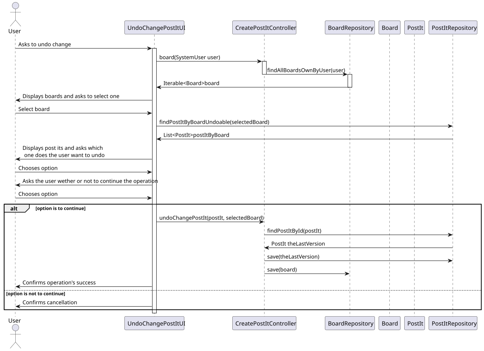
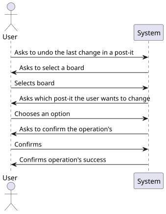
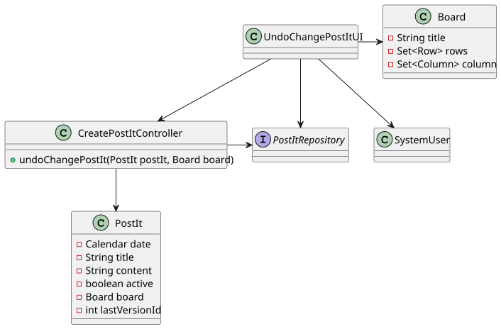

# US 3008

*As User, I want to undo the last change in a post-it*

## 1. Context

*This is the first time the task has been developed. In this task, a user undoes the last change in a post-it.*


## 2. Requirements

*Presentation of the functionality being developed*


**US G3008** As User, I want to undo the last change in a post-it

- G3008.1. Solution design

- G3008.2. Solution implementation

*Regarding this requirement, we understand that it relates to the creation of a post-it, and making changes in a post-it*

## 3. Analysis

*In this section, the team should report the study/analysis/comparison that was done in order to take the best design decisions for the requirement. This section should also include supporting diagrams/artifacts (such as domain model; use case diagrams, etc.),*

- All users are able to undo the last change in a post-it of a board they own or have access to 

## 4. Design

*This section presents the design of the solution that was adopted to solve the requirement.*

Using the standard base structure of the layered application.

Domain classes: Post-it

Controller: UndoPostItController

Repository: PostItRepository

### 4.1. Realization



### 4.2. Class Diagram



### 4.3. Applied Patterns

To develop this task, some patterns were used. In addition to Layered Architecture and Domain-Driven Design, we employed Service-Oriented Architecture (SOA), Container Architecture, Single Responsibility Principle.


### 4.4. Tests

```
 @Test
    public void testContentContainsHttpWhenTypeIsImage() {
            int typeOfContent = 2;
            if (typeOfContent == 1) {
                // Test case not applicable for typeOfContent 1
            } else if (typeOfContent == 2) {
                String content = "https://www.bing.com/images/search?view=detailV2&ccid=ilvIUpk5&id=53C71CFF9E743B79670914004530CA525B25DC27&thid=OIP.ilvIUpk5eCS26XBmYT9lUwHaE9&mediaurl=https%3a%2f%2fget.pxhere.com%2fphoto%2fhair-white-view-animal-cute-pet-fur-cat-mammal-facial-expression-close-up-nose-whiskers-sleepy-eye-furry-head-skin-moustache-vertebrate-expression-soft-ragdoll-animal-world-domestic-cat-himalayan-persian-breed-cat-cat-face-macro-photography-cat%27s-eyes-cat-portrait-mimic-german-longhaired-pointer-schmusekatze-small-to-medium-sized-cats-cat-like-mammal-domestic-long-haired-cat-british-semi-longhair-birman-893129.jpg&cdnurl=https%3a%2f%2fth.bing.com%2fth%2fid%2fR.8a5bc85299397824b6e97066613f6553%3frik%3dJ9wlW1LKMEUAFA%26pid%3dImgRaw%26r%3d0&exph=2592&expw=3872&q=cat&simid=607991108465417427&FORM=IRPRST&ck=104BA8EE5251F960E592BBDFE24B6612&selectedIndex=2&ajaxhist=0&ajaxserp=0";
                assertTrue("Content should contain 'http'", content.contains("http"));
            } else {
                // Unexpected typeOfContent value, fail the test
                assertFalse("Unexpected typeOfContent value", true);
            }
        }

    @Test
    public void testContentDoesNotContainHttpWhenTypeIsImage() {
        int typeOfContent = 2;
        if (typeOfContent == 1) {
            // Test case not applicable for typeOfContent 1
        } else if (typeOfContent == 2) {
            String content = "this is not an image";
            assertFalse("Content should not contain 'http'", content.contains("http"));
        } else {
            // Unexpected typeOfContent value, fail the test
            assertFalse("Unexpected typeOfContent value", true);
        }
    }
````

## 5. Implementation


