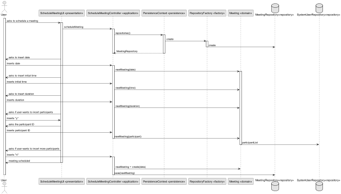
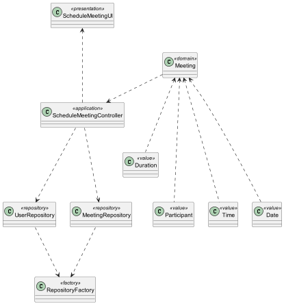
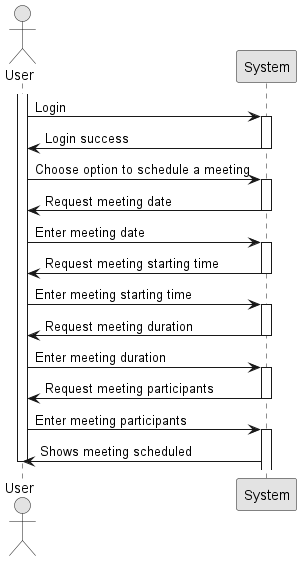

# US 1012

## 1. Context

*In this task, the user, wants to schedule a meeting*

## 2. Requirements

*Presentation of the functionality being developed*

**US G4001** As User, I want to schedule a meeting

- G4001.1. Solution design

- G4001.2. Solution implementation

## 3. Analysis

In this section, we report the study/analysis/comparison that was done to make the best design decisions for the requirement.

- The user is responsible for scheduling meetings.
- The meetingt has a date, a starting time, a duration, and participants.
- The participants have to receive an invitation after it has been confirmed they do not have any classes scheduled in that time.

## 4. Design

*This section presents the design of the solution that was adopted to solve the requirement.*

Domain class: Meeting

Values Objects: startingTime, duration, date, participants

Controller: ScheduleMeetingController

Repository: MeetingRepository, UserRepository

### 4.1. Realization

### 4.2. Class Diagram

### 4.3. Applied Patterns

### 4.4. Tests

## 5. Implementation

### [Class](eapli/base/meetingsManagement/application/ScheduleMeetingController.java)

### [Controller](eapli/base/meetingsManagement/domain/Meeting.java)

### [Repository](eapli/base/meetingsManagement/repositories/MeetingRepository.java)

## 6. Integration/Demonstration

## 7. Observations

No specific observations provided