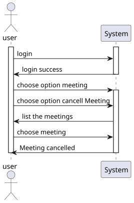
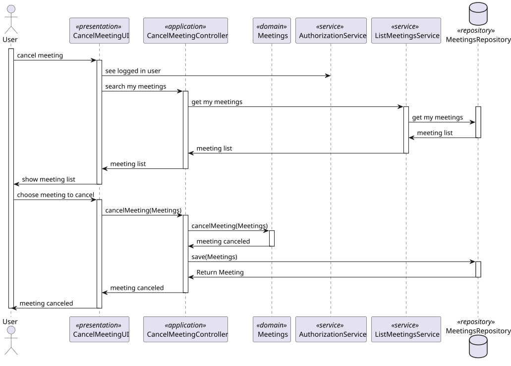
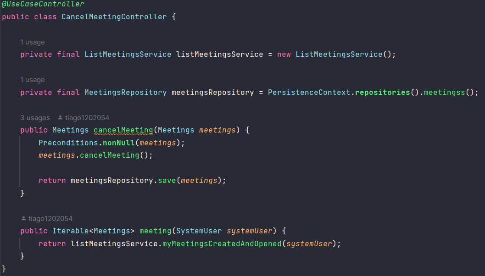
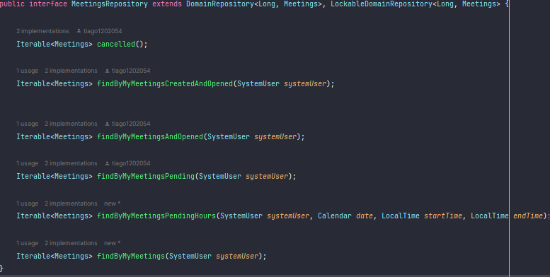

# US 4002


## 1. Context

*In this task, the User, I want to cancel a meeting*

## 2. Requirements

*Presentation of the functionality being developed*


**US G4002** As User, I want to cancel a meeting

- G4002.1. Solution design

- G4004.2. Solution implementation

*As for this requirement, we understand that it is the cancellation of a meeting made by a user.*



## 3. Analysis

In this section, we report the study/analysis/comparison that was done to make the best design decisions for the requirement.

- The meeting creator is responsible for canceling the meeting.
- the meeting must be in the opposite state of canceled.


## 4. Design

*This section presents the design of the solution that was adopted to solve the requirement.*

Using the standard base structure of the layered application.

Domain classes: Meetings

Values Objects: Invite, InviteStatus

Controller: CancelMeetingController

Repository: MeetingsRepository

Since meeting cancel will be carried out by only one person, the likelihood of duplicates occurring is greatly reduced. Therefore, we have chosen to prioritize writing and consistency.

To develop this task, some patterns were used. In addition to Layered Architecture and Domain-Driven Design, we employed Service-Oriented Architecture (SOA), Container Architecture, Single Responsibility Principle, and the Factory Method pattern belonging to the Gang of Four (GoF) design patterns category.



### 4.1. Class Diagram
Use the standard application framework based on layers


### 4.2. Applied Patterns

To develop this task, some patterns were used. In addition to Layered Architecture and Domain-Driven Design, we employed Service-Oriented Architecture (SOA), Container Architecture, Single Responsibility Principle, and the Factory Method pattern belonging to the Gang of Four (GoF) design patterns category.

### 4.3. Tests

Tests are made for the case of success and failure and border
```
    //main tests
    @Test
    public void NotCancellad(){
        Calendar c = Calendar.getInstance();
        LocalTime lt = LocalTime.now();
        LocalTime lt2 = lt.plusHours(1);

        Invite i = new Invite(getNewDummyUserTwo(),InviteStatus.PENDING);
        Invite i2 = new Invite(getNewDummyUserThree(),InviteStatus.PENDING);

        Set<Invite> set = new HashSet<>();
        set.add(i);
        set.add(i2);

        Meetings m = new Meetings(c,lt,lt2,set,false,getNewDummyUser());
        Assert.assertFalse(m.cancelled());
    }

    @Test
    public void Cancellad(){
        Calendar c = Calendar.getInstance();
        LocalTime lt = LocalTime.now();
        LocalTime lt2 = lt.plusHours(1);

        Invite i = new Invite(getNewDummyUserTwo(),InviteStatus.PENDING);
        Invite i2 = new Invite(getNewDummyUserThree(),InviteStatus.PENDING);

        Set<Invite> set = new HashSet<>();
        set.add(i);
        set.add(i2);

        Meetings m = new Meetings(c,lt,lt2,set,true,getNewDummyUser());
        Assert.assertTrue(m.cancelled());
    }

    @Test
    public void IsCancelled(){
        Calendar c = Calendar.getInstance();
        LocalTime lt = LocalTime.now();
        LocalTime lt2 = lt.plusHours(1);

        Invite i = new Invite(getNewDummyUserTwo(),InviteStatus.PENDING);
        Invite i2 = new Invite(getNewDummyUserThree(),InviteStatus.PENDING);

        Set<Invite> set = new HashSet<>();
        set.add(i);
        set.add(i2);

        Meetings m = new Meetings(c,lt,lt2,set,true,getNewDummyUser());
        Assert.assertTrue(m.cancelMeeting());
    }

    @Test
    public void IsNotCancelled(){
        Calendar c = Calendar.getInstance();
        LocalTime lt = LocalTime.now();
        LocalTime lt2 = lt.plusHours(1);

        Invite i = new Invite(getNewDummyUserTwo(),InviteStatus.PENDING);
        Invite i2 = new Invite(getNewDummyUserThree(),InviteStatus.PENDING);

        Set<Invite> set = new HashSet<>();
        set.add(i);
        set.add(i2);

        Meetings m = new Meetings(c,lt,lt2,set,true,getNewDummyUser());
        Assert.assertTrue(m.cancelMeeting());
    }
    
    @Test
    public void compareState(){
        Invite i = new Invite(getNewDummyUser(),InviteStatus.PENDING);
        Assert.assertEquals(i.inviteStatus(),InviteStatus.PENDING);
    }

    @Test
    public void failCompareState(){
        Invite i = new Invite(getNewDummyUser(),InviteStatus.PENDING);
        Assert.assertNotEquals(i.inviteStatus(),InviteStatus.REJECT);
    }

    @Test
    public void returnUser(){
        Invite i = new Invite(getNewDummyUser(),InviteStatus.PENDING);
        Assert.assertEquals(i.systemUser(),getNewDummyUser());
    }

    @Test
    public void failreturnUser(){
        Invite i = new Invite(getNewDummyUser(),InviteStatus.PENDING);
        Assert.assertNotEquals(i.systemUser(),getNewDummyUserTwo());
    }

    @Test
    public void returnInviteAsString(){
        Invite i = new Invite(getNewDummyUser(),InviteStatus.PENDING);
        Assert.assertEquals("PENDING",i.inviteStatusString());
    }

    @Test
    public void failReturnInviteAsString(){
        Invite i = new Invite(getNewDummyUser(),InviteStatus.PENDING);
        Assert.assertNotEquals("ACCEPT",i.inviteStatusString());
    }
````

## 5. Implementation

The `AggregateRoot` has been implemented in the `Meetings` class, and the framework's `ValueObject` has been implemented in the value objects.

## class Meetings


## class InviteStatus


## class Invite


## controller



## repository



## 6. Integration/Demonstration


