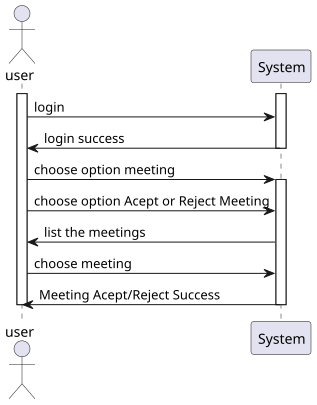
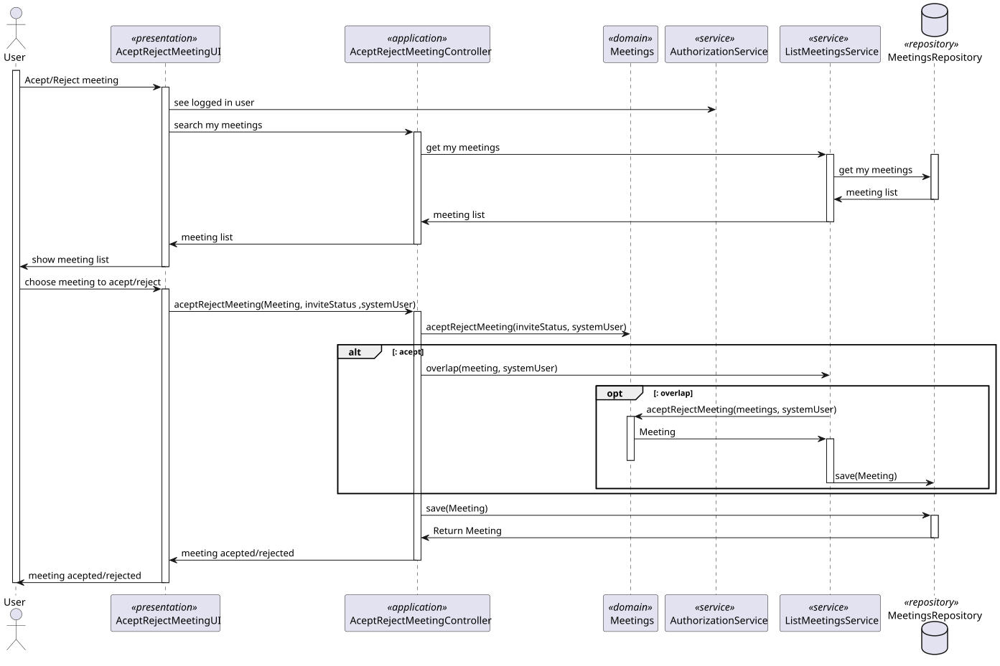
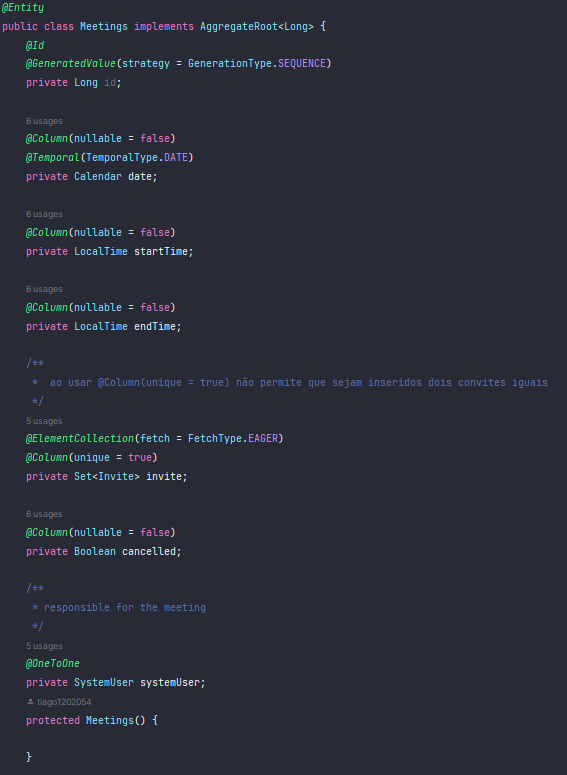
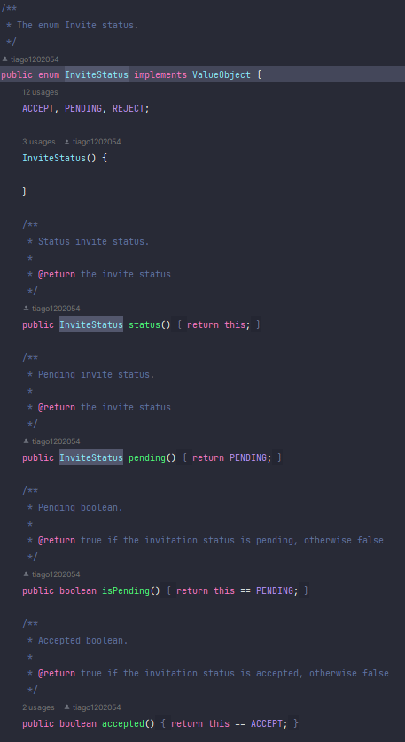
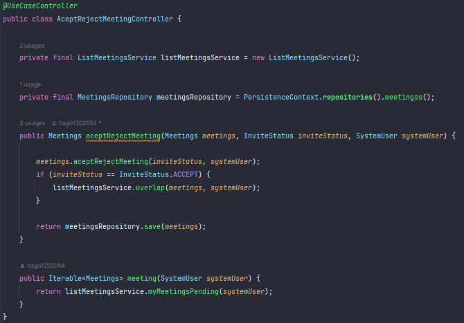
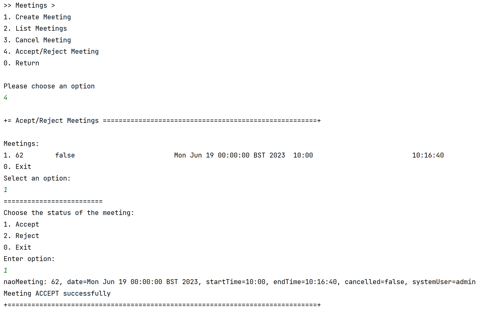

# US 4003


## 1. Context

*In this task, the User, I want to accept or reject a meeting request.*

## 2. Requirements

*Presentation of the functionality being developed*


**US G4003** As User, I want to accept or reject a meeting request

- G4003.1. Solution design

- G4003.2. Solution implementation

*As for this requirement, we understand that it is a matter of accepting or rejecting a meeting invitation.*

## 3. Analysis

In this section, we report the study/analysis/comparison that was done to make the best design decisions for the requirement.

- The user can only accept or decline the meeting once. 
- The operation occurs only once.
- If the meeting is accepted, any pending meetings that overlap with it are declined, including the meeting that has just been accepted.



## 4. Design

*This section presents the design of the solution that was adopted to solve the requirement.*

Using the standard base structure of the layered application.

Domain classes: Meetings

Values Objects: Invite, InviteStatus

Controller: AceptRejectMeetingController

Repository: MeetingsRepository

Since meeting accept or reject will be carried out by only one person, the likelihood of duplicates occurring is greatly reduced. Therefore, we have chosen to prioritize writing and consistency.

To develop this task, some patterns were used. In addition to Layered Architecture and Domain-Driven Design, we employed Service-Oriented Architecture (SOA), Container Architecture, Single Responsibility Principle, and the Factory Method pattern belonging to the Gang of Four (GoF) design patterns category.



### 4.1. Class Diagram
Use the standard application framework based on layers


### 4.2. Applied Patterns

To develop this task, some patterns were used. In addition to Layered Architecture and Domain-Driven Design, we employed Service-Oriented Architecture (SOA), Container Architecture, Single Responsibility Principle, and the Factory Method pattern belonging to the Gang of Four (GoF) design patterns category.

### 4.3. Tests

tests are made for the case of success and failure and border
```
    private final String aMecanographicNumber = "abc";
    private final String anotherMecanographicNumber = "xyz";

    public static SystemUser dummyUser(final String username, final Role... roles) {
        // should we load from spring context?
        final SystemUserBuilder userBuilder = new SystemUserBuilder(new NilPasswordPolicy(), new PlainTextEncoder());
        return userBuilder.with(username, "duMMy1", "dummy", "dummy", "a@b.ro").withRoles(roles).build();
    }

    private SystemUser getNewDummyUser() {
        return dummyUser("dummy", BaseRoles.ADMIN);
    }

    private SystemUser getNewDummyUserTwo() {
        return dummyUser("dummy-two", BaseRoles.ADMIN);
    }

    private SystemUser getNewDummyUserThree() {
        return dummyUser("dummy-three", BaseRoles.ADMIN);
    }

    private SystemUser getNewDummyUserFour() {
        return dummyUser("dummy-four", BaseRoles.ADMIN);
    }
    
    @Test
    public void aceptRejectInvitees(){
        Calendar c = Calendar.getInstance();
        LocalTime lt = LocalTime.now();
        LocalTime lt2 = lt.plusHours(1);

        Invite i = new Invite(getNewDummyUserTwo(),InviteStatus.PENDING);
        Invite i2 = new Invite(getNewDummyUserThree(),InviteStatus.PENDING);

        Set<Invite> set = new HashSet<>();
        set.add(i);
        set.add(i2);

        Set<Invite> set1 = new HashSet<>();
        set1.add(i);
        set1.add(i2);

        Meetings m = new Meetings(c,lt,lt2,set,false,getNewDummyUser());
        Meetings m2 = new Meetings(c,lt,lt2,set1,false,getNewDummyUserTwo());
        m2.aceptRejectMeeting(InviteStatus.ACCEPT,getNewDummyUserTwo());
        Assert.assertNotEquals(m,m2);
    }

    @Test
    public void compareMeetings(){
        Calendar c = Calendar.getInstance();
        LocalTime lt = LocalTime.now();
        LocalTime lt2 = lt.plusHours(1);

        Invite i = new Invite(getNewDummyUserTwo(),InviteStatus.PENDING);
        Invite i2 = new Invite(getNewDummyUserThree(),InviteStatus.PENDING);

        Set<Invite> set = new HashSet<>();
        set.add(i);
        set.add(i2);

        Meetings m = new Meetings(c,lt,lt2,set,false,getNewDummyUser());
        Meetings m2 = new Meetings(c,lt,lt2,set,false,getNewDummyUser());
        Assert.assertEquals(m, m2);
    }

    @Test
    public void failCompareMeetings(){
        Calendar c = Calendar.getInstance();
        LocalTime lt = LocalTime.now();
        LocalTime lt2 = lt.plusHours(1);

        Invite i = new Invite(getNewDummyUserTwo(),InviteStatus.PENDING);
        Invite i2 = new Invite(getNewDummyUserThree(),InviteStatus.PENDING);

        Set<Invite> set = new HashSet<>();
        set.add(i);
        set.add(i2);

        Meetings m = new Meetings(c,lt,lt2,set,false,getNewDummyUser());
        Meetings m2 = new Meetings(c,lt,lt2,set,false,getNewDummyUserFour());
        Assert.assertNotEquals(m, m2);
    }

    @Test
    public void sameASMeetings(){
        Calendar c = Calendar.getInstance();
        LocalTime lt = LocalTime.now();
        LocalTime lt2 = lt.plusHours(1);

        Invite i = new Invite(getNewDummyUserTwo(),InviteStatus.PENDING);
        Invite i2 = new Invite(getNewDummyUserThree(),InviteStatus.PENDING);

        Set<Invite> set = new HashSet<>();
        set.add(i);
        set.add(i2);

        Meetings m = new Meetings(c,lt,lt2,set,false,getNewDummyUser());
        Meetings m2 = new Meetings(c,lt,lt2,set,false,getNewDummyUser());
        Assert.assertTrue(m.sameAs(m2));
    }

    @Test
    public void identity(){
        Calendar c = Calendar.getInstance();
        LocalTime lt = LocalTime.now();
        LocalTime lt2 = lt.plusHours(1);

        Invite i = new Invite(getNewDummyUserTwo(),InviteStatus.PENDING);
        Invite i2 = new Invite(getNewDummyUserThree(),InviteStatus.PENDING);

        Set<Invite> set = new HashSet<>();
        set.add(i);
        set.add(i2);

        Meetings m = new Meetings(c,lt,lt2,set,false,getNewDummyUser());
        Assert.assertEquals(m.identity(), m.identity());
    }

    @Test
    public void NotCancellad(){
        Calendar c = Calendar.getInstance();
        LocalTime lt = LocalTime.now();
        LocalTime lt2 = lt.plusHours(1);

        Invite i = new Invite(getNewDummyUserTwo(),InviteStatus.PENDING);
        Invite i2 = new Invite(getNewDummyUserThree(),InviteStatus.PENDING);

        Set<Invite> set = new HashSet<>();
        set.add(i);
        set.add(i2);

        Meetings m = new Meetings(c,lt,lt2,set,false,getNewDummyUser());
        Assert.assertFalse(m.cancelled());
    }

    @Test
    public void Cancellad(){
        Calendar c = Calendar.getInstance();
        LocalTime lt = LocalTime.now();
        LocalTime lt2 = lt.plusHours(1);

        Invite i = new Invite(getNewDummyUserTwo(),InviteStatus.PENDING);
        Invite i2 = new Invite(getNewDummyUserThree(),InviteStatus.PENDING);

        Set<Invite> set = new HashSet<>();
        set.add(i);
        set.add(i2);

        Meetings m = new Meetings(c,lt,lt2,set,true,getNewDummyUser());
        Assert.assertTrue(m.cancelled());
    }

    @Test
    public void IsCancelled(){
        Calendar c = Calendar.getInstance();
        LocalTime lt = LocalTime.now();
        LocalTime lt2 = lt.plusHours(1);

        Invite i = new Invite(getNewDummyUserTwo(),InviteStatus.PENDING);
        Invite i2 = new Invite(getNewDummyUserThree(),InviteStatus.PENDING);

        Set<Invite> set = new HashSet<>();
        set.add(i);
        set.add(i2);

        Meetings m = new Meetings(c,lt,lt2,set,true,getNewDummyUser());
        Assert.assertTrue(m.cancelMeeting());
    }

    @Test
    public void IsNotCancelled(){
        Calendar c = Calendar.getInstance();
        LocalTime lt = LocalTime.now();
        LocalTime lt2 = lt.plusHours(1);

        Invite i = new Invite(getNewDummyUserTwo(),InviteStatus.PENDING);
        Invite i2 = new Invite(getNewDummyUserThree(),InviteStatus.PENDING);

        Set<Invite> set = new HashSet<>();
        set.add(i);
        set.add(i2);

        Meetings m = new Meetings(c,lt,lt2,set,true,getNewDummyUser());
        Assert.assertTrue(m.cancelMeeting());
    }

    @Test
    public void CalendarDate(){
        Calendar c = Calendar.getInstance();
        LocalTime lt = LocalTime.now();
        LocalTime lt2 = lt.plusHours(1);

        Invite i = new Invite(getNewDummyUserTwo(),InviteStatus.PENDING);
        Invite i2 = new Invite(getNewDummyUserThree(),InviteStatus.PENDING);

        Set<Invite> set = new HashSet<>();
        set.add(i);
        set.add(i2);

        Meetings m = new Meetings(c,lt,lt2,set,true,getNewDummyUser());
        Assert.assertEquals(c, m.Calendardate());
    }

    @Test
    public void startLocalTime(){
        Calendar c = Calendar.getInstance();
        LocalTime lt = LocalTime.now();
        LocalTime lt2 = lt.plusHours(1);

        Invite i = new Invite(getNewDummyUserTwo(),InviteStatus.PENDING);
        Invite i2 = new Invite(getNewDummyUserThree(),InviteStatus.PENDING);

        Set<Invite> set = new HashSet<>();
        set.add(i);
        set.add(i2);

        Meetings m = new Meetings(c,lt,lt2,set,true,getNewDummyUser());
        Assert.assertEquals(lt, m.startLocalTime());
    }

    @Test
    public void endLocalTime(){
        Calendar c = Calendar.getInstance();
        LocalTime lt = LocalTime.now();
        LocalTime lt2 = lt.plusHours(1);

        Invite i = new Invite(getNewDummyUserTwo(),InviteStatus.PENDING);
        Invite i2 = new Invite(getNewDummyUserThree(),InviteStatus.PENDING);

        Set<Invite> set = new HashSet<>();
        set.add(i);
        set.add(i2);

        Meetings m = new Meetings(c,lt,lt2,set,true,getNewDummyUser());
        Assert.assertEquals(lt, m.endLocalTime());
    }
````

## 5. Implementation

The `AggregateRoot` has been implemented in the `Meetings` class, and the framework's `ValueObject` has been implemented in the value objects.


## class Meetings



## class InviteStatus



## class Invite


## controller



## repository


## 6. Integration/Demonstration



## 7. Observations

When a user accepts a meeting, any pending meetings that overlap with it will be declined.