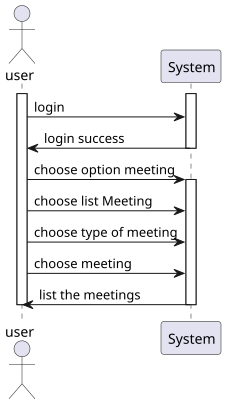
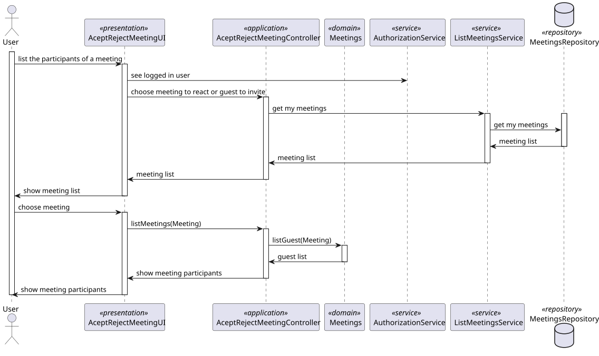
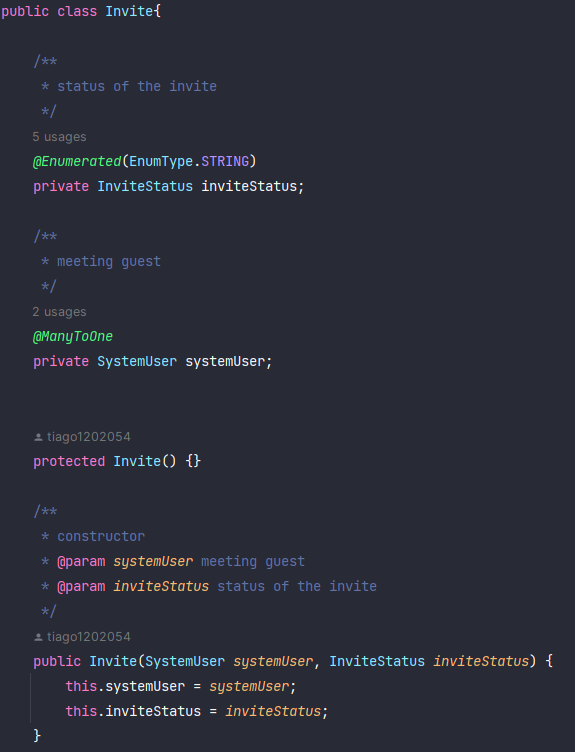
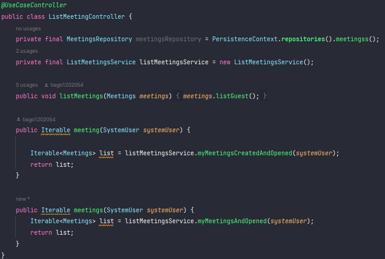
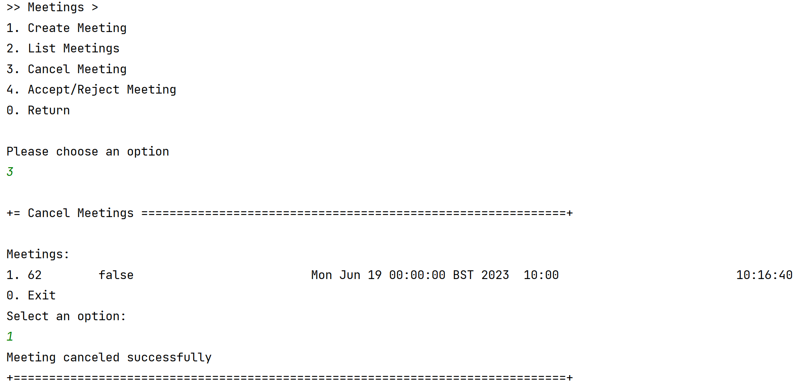

# US 4004


## 1. Context

*In this task, the User, I want to view a list of participants in my meeting and their status (accept or reject).*

## 2. Requirements

*Presentation of the functionality being developed*


**US G4004** As  User, I want to view a list of participants in my meeting and their status (accept or reject).

- G4004.1. Solution design

- G4004.2. Solution implementation

*Regarding this requirement, we understand that it is about listing the meetings that a user owns or the ones that he participates in.*

## 3. Analysis

In this section, we report the study/analysis/comparison that was done to make the best design decisions for the requirement.

- There is the possibility to choose the meeting.
- The participants' status and the meeting creator are displayed.



## 4. Design

*This section presents the design of the solution that was adopted to solve the requirement.*

Using the standard base structure of the layered application.

Domain classes: Meetings

Values Objects: Invite, InviteStatus

Controller: ListMeetingController

Repository: MeetingsRepository

The likelihood of duplicates occurring is greatly reduced. Therefore, we have chosen to prioritize writing and consistency.

To develop this task, some patterns were used. In addition to Layered Architecture and Domain-Driven Design, we employed Service-Oriented Architecture (SOA), Container Architecture, Single Responsibility Principle, and the Factory Method pattern belonging to the Gang of Four (GoF) design patterns category.



### 4.1. Class Diagram
Use the standard application framework based on layers


### 4.2. Applied Patterns

To develop this task, some patterns were used. In addition to Layered Architecture and Domain-Driven Design, we employed Service-Oriented Architecture (SOA), Container Architecture, Single Responsibility Principle, and the Factory Method pattern belonging to the Gang of Four (GoF) design patterns category.

### 4.3. Tests

tests are made for the case of success and failure and border
```
private final String aMecanographicNumber = "abc";
    private final String anotherMecanographicNumber = "xyz";

    public static SystemUser dummyUser(final String username, final Role... roles) {
        // should we load from spring context?
        final SystemUserBuilder userBuilder = new SystemUserBuilder(new NilPasswordPolicy(), new PlainTextEncoder());
        return userBuilder.with(username, "duMMy1", "dummy", "dummy", "a@b.ro").withRoles(roles).build();
    }

    private SystemUser getNewDummyUser() {
        return dummyUser("dummy", BaseRoles.ADMIN);
    }

    private SystemUser getNewDummyUserTwo() {
        return dummyUser("dummy-two", BaseRoles.TEACHER);
    }

    Teacher teacher = new Teacher(getNewDummyUserTwo(), new Acronym("ASD"), new TaxNumber("223925810"), new Date("12/12/1965"));
    Course course = new Course("Intro-Java-Sem01", "Java", "Programação Orientada Objetos", new Capacity(20,30), Status.CLOSE, teacher);
    @Test
    void sameAs() {
        Course course = new Course("Intro-Java-Sem01", "Java", "Programação Orientada Objetos", new Capacity(20,30), Status.CLOSE, teacher);
        assertTrue(course.sameAs(course));
    }

    @Test
    void sameAsInstance() {
        assertFalse(course.sameAs(teacher));
    }

    @Test
    void testEquals() {
        Course course = new Course("Intro-Java-Sem01", "Java", "Programação Orientada Objetos", new Capacity(20,30), Status.CLOSE, teacher);
        assertTrue(course.equals(course));
    }

    @Test
    void failTestEquals() {
        Course course = new Course("Intro-Java-Sem01", "Java", "Programação", new Capacity(20,30), Status.CLOSE, teacher);
        assertTrue(course.equals(course));
    }

    @Test
    void testHashCode() {
    }

    @Test
    void identity() {
        String expected = "Java";
        assertEquals(expected, course.identity());
    }

    @Test
    void failIdentity() {
        String expected = "Java1";
        assertNotEquals(expected, course.identity());
    }

    @Test
    void toDTO() {
        CourseDTO courseDTO = new CourseDTO("Java","Intro-Java-Sem01", "Programação Orientada Objetos", 20, 30, "CLOSE", "ASD","223925810");
        assertEquals(courseDTO, course.toDTO());
    }

    @Test
    void failtoDTO() {
        CourseDTO courseDTO = new CourseDTO("Java","Intro-Java-Sem01", "Programação Orientada Objetos", 20, 30, "CLOSE", "ASD","223925810");
        assertEquals(courseDTO, course.toDTO());
    }

    @Test
    void status() {
        Status expected = Status.CLOSE;
        assertEquals(expected, course.status());
    }

    @Test
    void failStatus() {
        Status expected = Status.OPEN;
        assertNotEquals(expected, course.status());
    }

    @Test
    void statusEntity() {
        Status expected = Status.OPEN;
        assertEquals(expected, course.status(Status.OPEN));
    }

    @Test
    void failStatusEntity() {
        Status expected = Status.ENROLL;
        assertNotEquals(expected, course.status(Status.OPEN));
    }

    @Test
    void title() {
        String expected = "Intro-Java-Sem01";
        assertEquals(expected, course.title());
    }

    @Test
    void failtitle() {
        String expected = "Intro-Java-Sem01";
        assertEquals(expected, course.title());
    }
````

## 5. Implementation

The `AggregateRoot` has been implemented in the `Meetings` class, and the framework's `ValueObject` has been implemented in the value objects.

## class Meetings


## class InviteStatus


## class Invite



## controller



## repository


## 6. Integration/Demonstration


